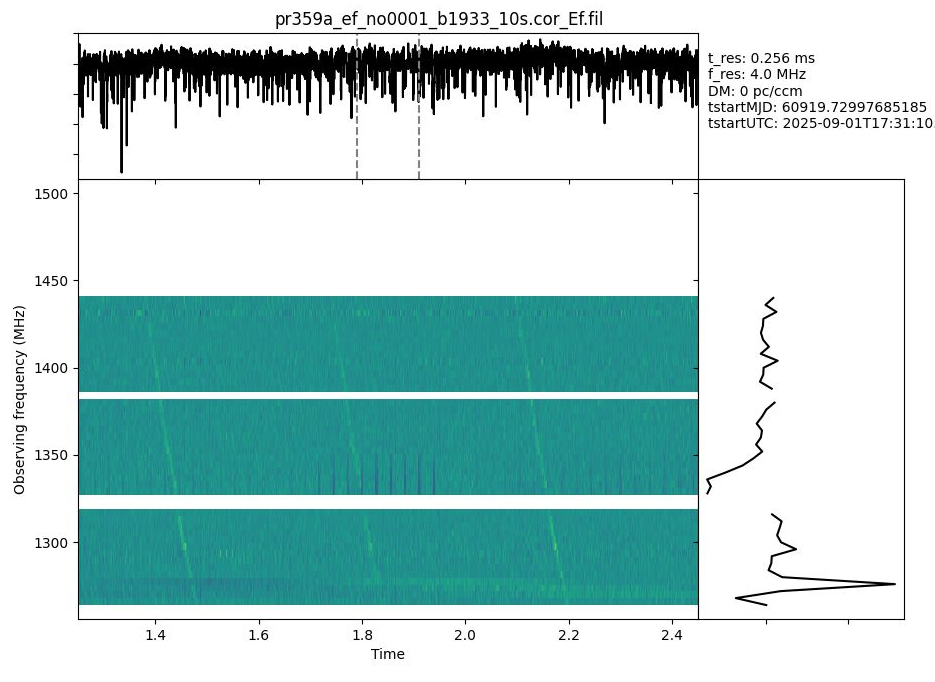
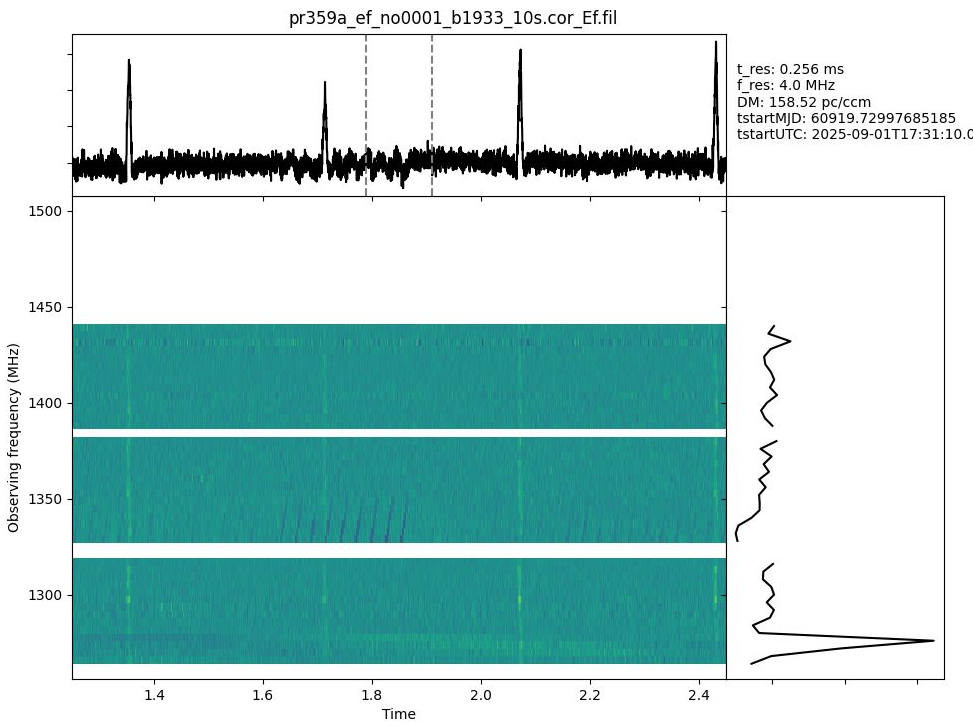
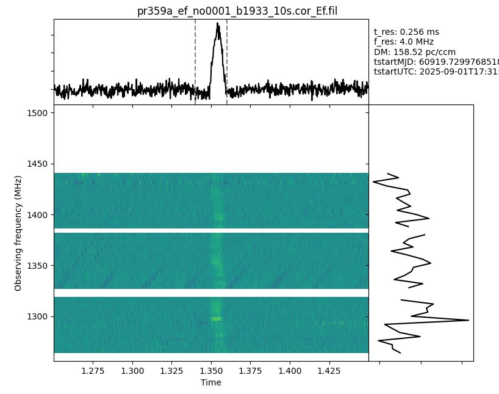
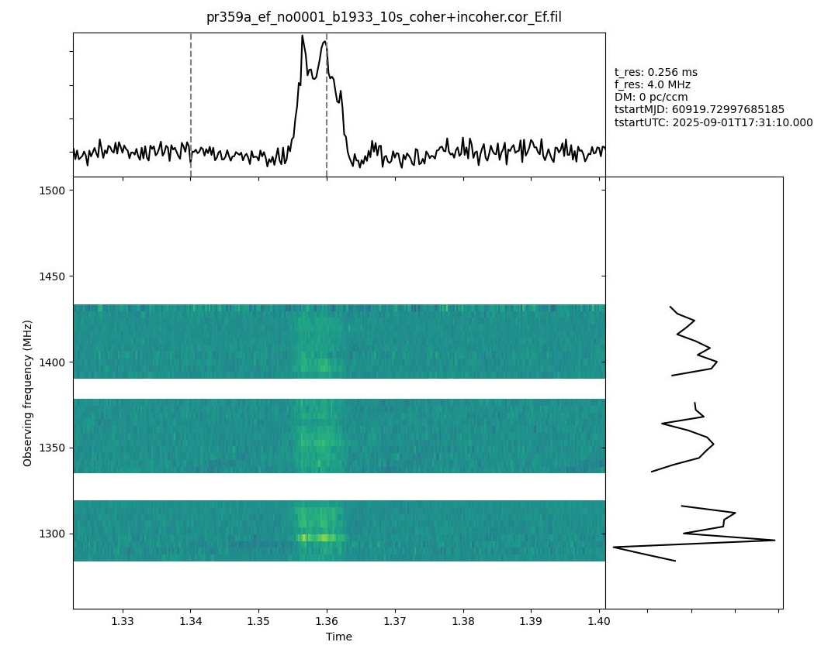
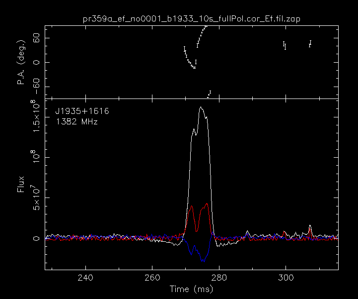
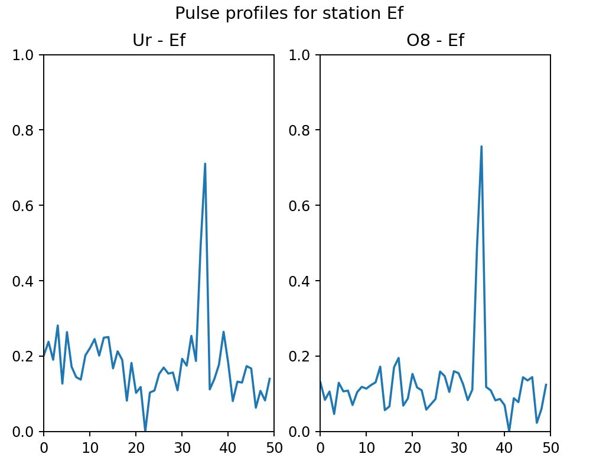
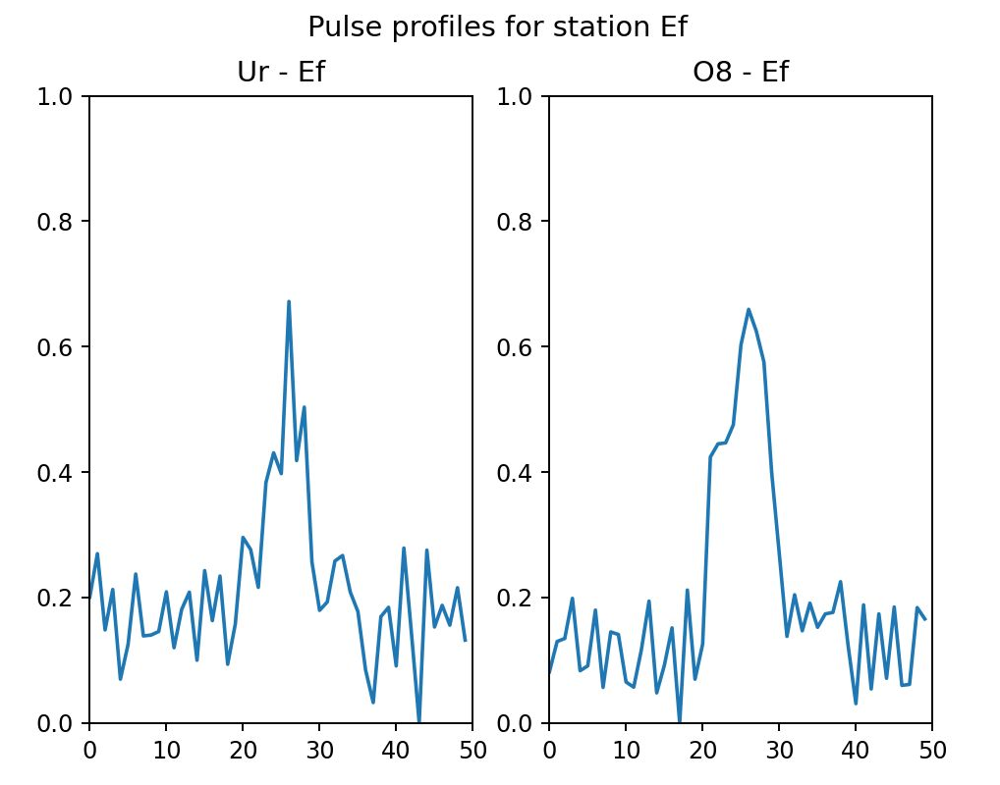

<!-- MathJax -->
<script src="https://cdnjs.cloudflare.com/ajax/libs/mathjax/2.7.7/MathJax.js?config=TeX-AMS-MML_HTMLorMML" type="text/javascript"></script> 
<script type="text/x-mathjax-config">
    MathJax.Hub.Config({
      tex2jax: {
        skipTags: ['script', 'noscript', 'style', 'textarea', 'pre'],
        inlineMath: [['$','$']],
        displayMath: [['$$','$$']]
      }
    });
</script>  

<script type="text/javascript">
var pcs = document.lastModified.split(" ")[0].split("/");
var date = pcs[1] + '/' + pcs[0] + '/' + pcs[2];
onload = function(){
    document.getElementById("lastModified").innerHTML = "Page last modified on " + date;
}
		</script>

<link href="styles.css" rel="stylesheet" />

<!-- Prism CSS -->
<link rel="stylesheet" href="https://cdnjs.cloudflare.com/ajax/libs/prism/1.29.0/themes/prism.min.css" />
<link id="prism-dark" rel="stylesheet" href="https://cdnjs.cloudflare.com/ajax/libs/prism/1.29.0/themes/prism-tomorrow.min.css" disabled />
<link rel="stylesheet" href="https://cdnjs.cloudflare.com/ajax/libs/prism/1.29.0/plugins/line-numbers/prism-line-numbers.min.css" />

<!-- Prism JS -->
<script src="https://cdnjs.cloudflare.com/ajax/libs/prism/1.29.0/prism.min.js"></script>
<script src="https://cdnjs.cloudflare.com/ajax/libs/prism/1.29.0/components/prism-python.min.js"></script>
<script src="https://cdnjs.cloudflare.com/ajax/libs/prism/1.29.0/plugins/line-numbers/prism-line-numbers.min.js"></script>

[Return to the homepage](index.md)
# SFXC workshop 2025 • Pulsar processing


## On this page
1. [Introduction](#introduction)
2. [Data download](#data-download)
3. [Singularity Images](#singularity-images)
4. [Producing filterbank format output + run PSR tools](#filterbank-psr-tools)
5. [Pulsar Gating](#pulsar-gating)

## Introduction
Pulsar processing is special in the sense that 
- the signal is **dispersed** and that
- the pulsar is "off" most of the time.

The dispersion is caused by the fact that the signal traverses the interstellar medium
which is filled with free electrons at varying densities $n_e$. This does not only lead to
multi-path propagation but, as such, the medium has a
frequency dependent index of refraction which in turn leads to lower frequencies arriving
later at the observer than higher frequencies. This time delay, $\Delta t$, is
proportional to the total amount of electrons along the line of sight $dl$ -- the dispersion
measure or ${DM}=\int n_e\,dl$ -- and it is proportional to the square of frequency:

$\frac{\Delta t}{\text{[ms]}} = 4.15 * \text{DM} * \left [\left (\frac{\nu_{\text{low}}}{[\text{GHz}]}\right )^{-2} - \left (\frac{\nu_{\text{high}}}{[\text{GHz}]}\right )^{-2}\right]$


Thus, in order to achieve the highest signal-to-noise possible, the data need to be
de-dispersed at the correct dispersion measure and we can apply a technique called
**gating** to only correlate the data when the pulsar is "on". In this tutorial we will use SFXC to
first generate filterbank format files (intensities as a function of time and frequency)
from the single dish data. We will take a quick peak at what a pulsar looks like in the
data and we'll use SFXC's capabilities of creating coherently dedispersed, full
polarisation filterbanks to create a folded full polarisation pulse profile of the pulsar
B1933+16. 

Eventually, we will use standard pulsar tools to generate a so-called "polyco" file, a
file that contains the polynomial coefficients used to predict the time of arrival (TOA) of
individual pulses. It is these TOAs that the correlator needs to extract only the chunks
of data when the pulsar is "on". We will generate gated output files and also take a look
at pulsar binning -- this is when we do not use only one on-off gate but instead place
several bins across the pulse profile. This can either be used to boost the S/N of
correlated pulsar data even further by weighting the data according to the brightness of
the pulsar per bin (**references**) or one can, e.g., perform phase-resolved pulsar
scintillometry (**reference to Ue-Li**).

## Data download
_Add links and instructions for obtaining the relevant datasets here._

## Singularity Images
_Need to find where to upload singularity containers that container pulsar software_

## Producing filterbank format output + run PSR tools
Let's generate a filterbank file from the
baseband data of one of the stations in our observations. We chose to use the data from
Effelsberg as it is the most sensitive dish in the array.

The aim of this exercise is to a) introduce the pulsar-related capabilities of SFXC and b)
show some basics of pulsar analysis software. 
### Prepare the vex file
The vex file as it was generated using `sched` (or `pysched`) does not yet contain all the
info required by the correlator. E.g., it's missing the `CLOCKS` section as well as the `EOP`
section. This can be fixed by running 

```bash
prepare_vex.py pr359a.vex pr359a.vix
```

This utility is shipped with SFXC. The generated vix file contains the correct sections
but the `CLOCKS` will all be zero. To get the clock delays right one would now perform
clock searching as shown in the [correlation tutorial--link needed](do we hav a
link?). Here we have already fixed the clocks for the stations relevant for this tutorial:
Ef, Ur, O8 in the provided vis file.

> **Caution**: In case the LO-frequency is above the sky frequency, the frequency order in
> the subbands will be reversed. prepare_vex.py does not currently fix this; i.e. this
> to be done manually.

- **add expert notes on vdif-splitting for freq-flip**

### Prepare the ctrl file

As a first step we'll create a 10s-filterbank as outlined below:

```yaml
{
    "number_channels": 8,           # number of channels per subband 
    "cross_polarize": false,
    "integr_time": 1.024,           # in seconds needs to be an integer multiple of: 
    "sub_integr_time": 256.0,       # sub_integr_time (in us); cannot be less than the time equivalent of (depends on the sampling rate of course):
    "fft_size_correlation": 128,    # number of samples per FFT; 
    "start": "2025y244d17h31m10s",
    "stop": "2025y244d17h31m20s",
    "filterbank": true,             # generate output that can be converted to filterbank
    "pulsar_binning": false,
    "output_file": "file:///path/to/pr359a_ef_no0001_b1933_10s.cor",
    "delay_directory": "file:///path/to/delay-tables/",
    "data_sources": {
        "Ef": [
            "file:///path/to/pr359a_ef_no0001"
        ]
    },
    "stations": [
        "Ef"
    ],
    "channels": [
        "CH01",
        "CH02",
        "CH03",
        "CH04",
        "CH05",
        "CH06",
        "CH07",
        "CH08",
        "CH09",
        "CH10",
        "CH11",
        "CH12",
        "CH13",
        "CH14",
        "CH15",
        "CH16"
    ],
    "exper_name": "pr359a",
    "normalize": false,
    "window_function": "NONE",
    "message_level": 1
}
```

### Run the correlator and convert the output to filterbank

```bash
mpirun -n 22 sfxc pr359a_ef_no0001_b1933.ctrl pr359a.vix
# if using the singularity image:
mpirun -n 22 singularity run /path/to/sfxc-coherent.simg sfxc pr359a_ef_no0001_b1933.ctrl pr359a.vix
```

> **TIPP**: In case the above gives you an error about not enough cores resent, you may need to add
> --use-hwthread-cpus or, alternatively, --oversubscribe 

The output file will be at `/path/to/pr359a_ef_no0001_b1933_10s.cor_Ef` -- note the suffix
 `Ef` since this is for station Effelsberg. Now we'll convert this to filterbank format as
 regular pulsar software cannot handle the output format of SFXC.

```bash
cor2filterbank.py pr359a.vix pr359a_ef_no0001_b1933_10s.cor_Ef pr359a_ef_no0001_b1933_10s.cor_Ef.fil

# if using the singularity image either execute like this:
singularity run /path/to/sfxc-coherent.simg /usr/local/src/sfxc/frb_runjob/cor2filterbank.py pr359a.vix pr359a_ef_no0001_b1933_10s.cor_Ef pr359a_ef_no0001_b1933_10s.cor_Ef.fil

# or enter into an 'interactive' session
singularity shell -e /path/to/sfxc-coherent.simg

# and run like so:
/usr/local/src/sfxc/frb_runjob/cor2filterbank.py pr359a.vix pr359a_ef_no0001_b1933_10s.cor_Ef pr359a_ef_no0001_b1933_10s.cor_Ef.fil
```

`cor2filterbank.py` has a bunch of different options. Above we're running it at defaults,
generating a Stokes I filterbank. Options are:

```bash
cor2filterbank.py --help
Usage: Usage : cor2filterbank.py [OPTIONS] <vex file> <cor file 1> ... <cor file N> <output_file>

Options:
  -h, --help            show this help message and exit
  -i IFS, --ifs=IFS     Range of sub-bands to correlate, format first:last.
                        For example -i 0:3 will write the first 4 sub-bands.
  -s SETUP_STATION, --setup-station=SETUP_STATION
                        Define setup station, the frequency setup of this
                        station is used in the conversion. The default is to
                        use the first station in the vexfile
  -b, --bandpass        Apply bandpass
  -z, --zerodm          Apply zerodm subtraction
  -d, --decimate-freq   Compensate for zeropadding by removing the odd
                        numbered frequency points, default=no
  -p POL, --pol=POL     Which polarization to use: R, L, I (=R+L), or F(=R,
                        Re(RL), Im(RL), L), default=I
```

### Take a look at what's in the filterbank
For the below we will work in the singularity image that contains all of the pulsar
software tools that we need. It can be retrieved from [here -- fix link](link
to workshop image).
Enter the image like so to run things interactively
```bash
singularity shell -e /path/to/psrsoft.simg
```

Now we can plot what's in the filterbank with `waterfaller.py` that comes with the `PRESTO`
package. Here we're using a slightly modified version that has some functionality added
to it, such as flagging channels and setting the dynamic range (can be found on [Franz'
github](https://github.com/pharaofranz/presto)). The outcome should look something like
[Figure 1](#fig-1). 

```bash
waterfaller.py --show-ts --show-spec -T 1.25 -t 1.2 --killchans 0-16,31,46-47,62-63 \
  pr359a_ef_no0001_b1933_10s.cor_Ef.fil --full_info --colour-map viridis \
  --vmin -1 --vmax 1
```

> Tipp: In case no plots are being shown with the command above, you may need to set the
> environement variable `$DISPLAY`. Before starting the image as shown above, check what the
> variable is set to in your terminal via
> `echo $DISPLAY`
> Once you're in the image, you need to set `$DISPLAY` to whatever the outcome is of the
> above by running
> `export DISPLAY=<output from above`




<a name="fig-1">**Figure 1**</a> - *Dynamic spectrum (main panel), frequency-collapses
time series (top panel) and time-averaged spectrum (right panel) as generated with
`PRESTO`'s `waterfaller.py`. Here we flagged the worst RFI, visible as white horizontal "lines". One can
cleary see the quadratic sweep of the pulses, as well as more RFI. The pulses do not yet
pop out in the time series as they are still dispersed.*

We can now apply incoherent dedispersion as it is provided by `waterfaller.py` via the
flag `-d <DM>` to get [Figure 2](#fig-2)

```bash
waterfaller.py --show-ts --show-spec -T 1.25 -t 1.2 --killchans 0-16,31,46-47,62-63 \
  pr359a_ef_no0001_b1933_10s.cor_Ef.fil --full_info --colour-map viridis \
  --vmin -1 --vmax 1 -d 158.52
```



<a name="fig-2">**Figure 2**</a> - *Same as [Figure 1](#fig-1) but with incoherent
dedispersion applied.*
And we can even zoom in on one pulse -- see [Figure 3](#fig-3). What you will see is that
things do not align perfectly in frequency. This is caused by residual dispersion
smearing; residual in the sense that not all the dispersion has been taken out, in
particular that within a channel. We chose quite a crude channelisation just to show this
effect. The amount of residual smearing per bandwidth $BW$ at a certain central frequency
$\nu$ is approximated as 

$\frac{\delta \tau}{\mu s} = 8.3 * \frac{\text{BW}}{[\text{MHz}]} * \text{DM} * \left
(\frac{\nu}{[\text{GHz}]}\right )^{-3}$



<a name="fig-3">**Figure 3**</a> - *Zoom in on a single pulse with incoherent dedispersion
applied. The pulse does not appear "straight" in the dynamic spectrum because of residual
dispersion smearing: we chose quite a crude frequency resolution leading to some
dispersive delay being present **within** a channel.*

### Generate coherently dedispersed filterbank with SFXC
Of course we can try and compensate for the residual smearing by increasing the number of
frequency channels in the fitlerbanks. However, this will come at the cost of time
resolution which in the case of a millisecond pulsar (or and FRB) will disable us look for
fine structure. Therefore we can use coherent dedispersion which removes any residual
dispersion smearing also **within** a channel.
- prep the control file:

```yaml
{
    "number_channels": 8,
    "cross_polarize": false,
    "integr_time": 1.024,
    "sub_integr_time": 256.0,
    "fft_size_correlation": 128,
    "start": "2025y244d17h31m10s",
    "stop": "2025y244d17h31m20s",
    "output_file": "file:///data1/franz/pr359a/sfxc/pr359a_ef_no0001_b1933_10s_coher+incoher.cor",
    "filterbank": true,
     "pulsars": {
        "B1933+16_D": {
            "polyco_file": "file:///data1/franz/pr359a/sfxc/b1933.polyco",
            "no_intra_channel_dedispersion": false,
            "coherent_dedispersion": true
        }
    },
    "pulsar_binning": false,
### everything else stays the same
```

- we require a so-called polyco file which contains info about the pulsar; most important
here the DM: 

```bash
cat b1933.polyco
1935+1616  31-Aug-25   93000.00   60918.39583333330           158.521055  0.496 -8.844
   3488444629.211404    2.787546496219  coe  300   3  1400.000                
  0.00000000000000000e-10 -0.00000000000000000e-02 -0.00000000000000000e-08

```
- run correlator
- convert
- plot again with waterfaller.py

```bash
waterfaller.py --show-ts --show-spec -T 1.25 -t 0.2 --full_info --colour-map viridis --killchans 0-18,30-32,44-47,57-63 --vmin -1 --vmax 1 pr359a_ef_no0001_b1933_10s_coher+incoher.cor_Ef.fil
```



<a name="fig-4">**Figure 4**</a> - *Single burst coherently dedispersed. Substructure
becomes evident now.*

### Create full polarisation filterbank, fold and plot it
```yaml
{
    "number_channels": 128,            # <-- note we use more channels now
    "fft_size_correlation": 128,
    "cross_polarize": true,            # <---- full Polarisation
    "integr_time": 2.048,
    "sub_integr_time": 256.0,
    "start": "2025y244d17h31m10s",
    "stop": "2025y244d17h31m20s",
    "output_file": "file:///path/to/pr359a_ef_no0001_b1933_10s_fullPol.cor", # <---- change output
    file name to not get confused later
}
# ---- everything else stays the same
```
- run correlator
```bash
mpirun -n 10 sfxc pr359a_ef_no0001_b1933_10s_fullPol.ctrl pr359a.vix
```
- convert with cor2filterbank but set correct flags (`-p F`)
```bash
cor2filterbank.py pr359a.vix pr359a_ef_no0001_b1933_10s_fullPol.cor_Ef pr359a_ef_no0001_b1933_60s_fullPol.cor_Ef.fil -p F
```
- create a "par" file (contains pulsar parameters like period, period derivative,
dispersion measure) with `psrcat`:
```bash
psrcat -e B1933+16 > B1933.par
```
- run dspsr on the full polarisation filterbank file with the par-file that we just created:
```bash
dspsr -E B1933.par -L 1 -A -k effelsberg -d4
pr359a_ef_no0001_b1933_10s_fullPol.cor_Ef.fil -O
pr359a_ef_no0001_b1933_10s_fullPol.cor_Ef.fil
#### Flags set here are:
# -E <par file> : par file to use
# -L <seconds>  : number of seconds per "sub-integration"
# -A            : create a single output file (otherwise there will be one per
"sub-integration" of 1s length
# -d <pol-product> : what polarisation product to create; the 4 means full pol
```
- flag the bad channels interactively (press 'h' to get instructions on the terminal)
```bash
psrzap pr359a_ef_no0001_b1933_10s_fullPol.cor_Ef.fil.ar
```
- When you're done flagging, write out the flagged file and exit via 'Q' (new file will
  have suffix `zap` instead of `ar`.
- Now let's plot the folded full polarisation profile (should look like [Figure 5](#fig-5).
```bash
psrplot -D /XWIN pr359a_ef_no0001_b1933_10s_fullPol.cor_Ef.fil.zap \
        -j tscrunch,dedisperse,fscrunch \   # summing up in time and frequency
        -p Scyl \                           # request full pol plot
        -c 'x:unit=ms' \                    # set the unit of the x-axis to 'ms'
        -c 'x:bin=650:900'                  # zoom in on phase bins 250-350
```


<a name="fig-5">**Figure 5**</a> - *Full polarisation profile of B1933+16, zoomed in on
the pulse profile. The top panel shows the polarisation position angle swing while in the
bottom panel the red and blue lines show the linear and circular polarisation intensity,
respectively. The while line is the total intensity.*
applied.*

## Pulsar Gating
In pulsar gating we do the following...
### Create polyco for gating.
```bash
# from inside the singularity container
tempo2 -f B1933+16.psrcat.par -polyco "60918 60920 300 12 8 coe 1400.0" -tempo1
mv 
```
### Prepare the ctrl file
```yaml
{
    "number_channels": 128,
    "cross_polarize": false,
    "integr_time": 2.048,
    "start": "2025y244d17h31m10s",
    "stop": "2025y244d17h31m20s",
    "output_file": "file:///path/to/pr359a_ef-ur-o8_no0001_b1933_10s.cor",
    "filterbank": false,
    "pulsars": {
        "B1933+16_D": {
            "polyco_file": "file:///path/to/b1933-full.polyco",
            "no_intra_channel_dedispersion": false,
            "coherent_dedispersion": false,
            "nbins": 50,
            "interval": [
              0,          # we do the full phase range at first and refine later
              1
            ]
        }
    },
    "pulsar_binning": true,
    "normalize": false,
    "window_function": "NONE",
    "delay_directory": "file:///data1/franz/pr359a/sfxc",
    "data_sources": {
        "Ef": [
            "file:///data1/franz/pr359a/sfxc/pr359a_ef_no0001"
        ],
        "Ur": [
            "file:///data1/franz/pr359a/sfxc/pr359a_ur_no0001"
        ],
        "O8": [
            "file:///data1/franz/pr359a/sfxc/pr359a_o8_no0001"
        ]
    },
    "stations": [
        "Ef",
        "Ur",
        "O8"
    ],
    "channels": [
        "CH01",
        "CH02",
        "CH03",
        "CH04",
        "CH05",
        "CH06",
        "CH07",
        "CH08",
        "CH09",
        "CH10",
        "CH11",
        "CH12",
        "CH13",
        "CH14",
        "CH15",
        "CH16"
    ],
    "exper_name": "pr359a",
    "message_level": 1
}
```


<a name="fig-XYZ1">**Figure XYZ1**</a> - *Pulse "profiles" on the Ef-Ur and Ef-O8
baselines. The pulse period (~358.7ms) is broken up into 50 time bins (~7.2ms each) based on the
polynomial coefficients from `tempo2`. Each "set" of data (10s/358.7ms=28 chunks) is
correlated individually. The bin that contains the pulse clearly sticks out. In a way,
this is a "folded" pulsar profile.*

- refine the gates, i.e. change the interval from [0,1] to [?,?]


<a name="fig-XYZ2">**Figure XYZ2**</a> - *Same as [Figure XYZ1](fig-XYZ1) but zoomed in on
the pulse phase range 0.65-0.75. Now the substructure also becomes available here.*


## Current & future developments

## Resources
### Technical papers/memos on wide-field correlation

---
_Content built by Franz Kirsten._ <i><span id="lastModified"></span></i>

_Built with ♥ — Markdown + HTML + CSS + Prism.js + a bit of AI + Jack Radcliffe (2025)_

<!-- Custom Script: funcs.js -->
<script>
    const copy = (el) => {
      const pre = document.querySelector(el);
      if (!pre) return;
      const code = pre.innerText;
      navigator.clipboard.writeText(code).then(() => {
        const btn = document.querySelector(`[data-copy="${el}"]`);
        if (!btn) return;
        const old = btn.textContent;
        btn.textContent = 'Copied!';
        setTimeout(() => (btn.textContent = old), 1500);
      });
    };
    document.addEventListener('click', (e) => {
      const t = e.target;
      if (t.matches('.copy-btn')) {
        const target = t.getAttribute('data-copy');
        copy(target);
      }
    });
</script>
