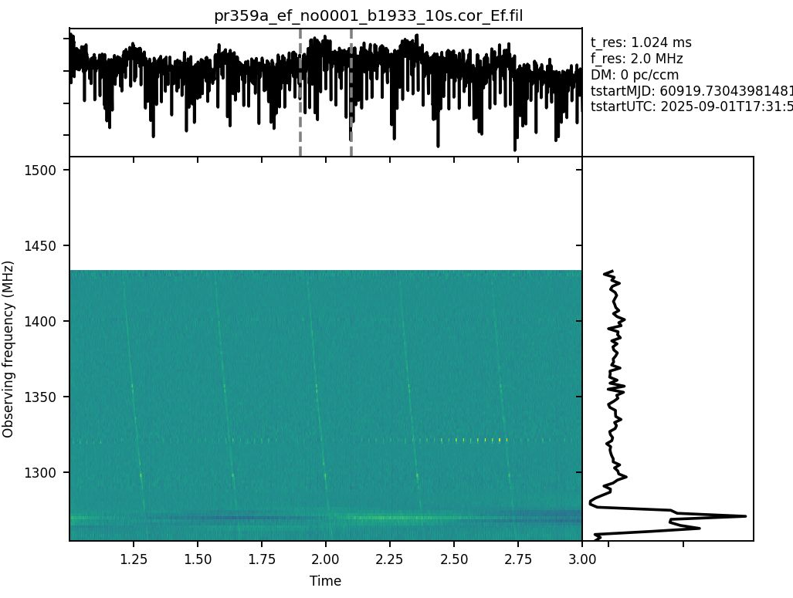

<!-- MathJax -->
<script src="https://cdnjs.cloudflare.com/ajax/libs/mathjax/2.7.7/MathJax.js?config=TeX-AMS-MML_HTMLorMML" type="text/javascript"></script> 
<script type="text/x-mathjax-config">
    MathJax.Hub.Config({
      tex2jax: {
        skipTags: ['script', 'noscript', 'style', 'textarea', 'pre'],
        inlineMath: [['$','$']],
        displayMath: [['$$','$$']]
      }
    });
</script>  

<script type="text/javascript">
var pcs = document.lastModified.split(" ")[0].split("/");
var date = pcs[1] + '/' + pcs[0] + '/' + pcs[2];
onload = function(){
    document.getElementById("lastModified").innerHTML = "Page last modified on " + date;
}
		</script>

<link href="styles.css" rel="stylesheet" />

<!-- Prism CSS -->
<link rel="stylesheet" href="https://cdnjs.cloudflare.com/ajax/libs/prism/1.29.0/themes/prism.min.css" />
<link id="prism-dark" rel="stylesheet" href="https://cdnjs.cloudflare.com/ajax/libs/prism/1.29.0/themes/prism-tomorrow.min.css" disabled />
<link rel="stylesheet" href="https://cdnjs.cloudflare.com/ajax/libs/prism/1.29.0/plugins/line-numbers/prism-line-numbers.min.css" />

<!-- Prism JS -->
<script src="https://cdnjs.cloudflare.com/ajax/libs/prism/1.29.0/prism.min.js"></script>
<script src="https://cdnjs.cloudflare.com/ajax/libs/prism/1.29.0/components/prism-python.min.js"></script>
<script src="https://cdnjs.cloudflare.com/ajax/libs/prism/1.29.0/plugins/line-numbers/prism-line-numbers.min.js"></script>

[Return to the homepage](index.md)
# SFXC workshop 2025 • Pulsar processing


## On this page
1. [Introduction](#introduction)
2. [Data download](#data-download)
3. [Singularity Images](#singularity-images)
4. [Producing filterbank format output + run PSR tools](#filterbank-psr-tools)
5. [Pulsar Gating](#pulsar-gating)

## Introduction
Pulsar processing is special in the sense that 
- the signal is **dispersed** and that
- the pulsar is "off" most of the time.

Thus, in order to achieve the highest signal-to-noise possible, the data need to be
de-dispersed at the correct dispersion measure and we can apply a technique called
**gating** to only use data when the pulsar is "on".

### Dispersion
- add a nice plot of dispersion
- and an illustration of what dedispersion does
- ideally both with a dynamic spectrum and the frequency-collapsed time series on top
- let's ignore scattering for now.
- include definition of DM, maybe even a fancy movie?

### Pulsar timing
- intro to pulsar timing and how to generate and use an ephemeris file

[//]: # (Only in-line math works on the Github-pages site:)
[//]: # ($\gamma = \lim_{n\to\infty}\left(\sum_{k=1}^n \frac{1}{k} - \ln(n)\right)$)

## Data download
_Add links and instructions for obtaining the relevant datasets here._

## Singularity Images
_Need to find where to upload singularity containers that container pulsar software_

## Producing filterbank format output + run PSR tools
What we'll do in this tutorial is to use SFXC to generate a filterbank file from the
baseband data of one of the stations in our observations. We chose to use the data from
Effelsberg as it is the most sensitive dish in the array.

The aim of this exercise is to a) introduce the pulsar-related capabilities of SFXC and b)
show some basics of pulsar analysis software. 
### Prepare the vex file
The vex file as it was generated using `sched` (or `pysched`) does not yet contain all the
info required by the correlated. E.g., it's missing the `CLOCKS` section as well as the `EOP`
section. This can be fixed by running 
```bash
prepare_vex.py pr359a.vex pr359a.vix
```
This utility is shipped with SFXC. 
> **Caution**: In case the LO-frequency is above the sky frequency, the frequency order in
> the subbands will be reversed. prepare_vex.py does not currently fix this; i.e. this
> to be done manually.
### Prepare the ctrl file
```yaml
{
    "number_channels": 128,
    "cross_polarize": false,
    "integr_time": 2.048,
    "sub_integr_time": 1024.0,
    "fft_size_correlation": 128,
    "start": "2025y244d17h31m50s",
    "stop": "2025y244d17h32m00s",
    "output_file": "file:///path/to/pr359a_ef_no0001_b1933.cor",
    "filterbank": true,
    "pulsar_binning": false,
    "normalize": false,
    "window_function": "NONE",
    "data_sources": {
        "Ef": [
            "file:///path/to/pr359a_ef_no0001"
        ]
    },
    "stations": [
        "Ef"
    ],
    "channels": [
        "CH01",
        "CH02",
        "CH03",
        "CH04",
        "CH05",
        "CH06",
        "CH07",
        "CH08",
        "CH09",
        "CH10",
        "CH11",
        "CH12",
        "CH13",
        "CH14",
        "CH15",
        "CH16"
    ],
    "exper_name": "pr359a",
    "delay_directory": "file:///path/to/delay-tables/",
    "message_level": 1
}
```
### Run the correlator and convert the output to filterbank
```bash
mpirun -n 10 sfxc pr359a_ef_no0001_b1933.ctrl pr359a.vix
# in case you get an error about not enough cores present, you may need to add
--use-hwthread-cpus
```
The output file will be at `/path/to/pr359a_ef_no0001_b1933.cor_Ef` -- note the suffix
 `Ef` since this is for station Effelsberg. Now we'll convert this to filterbank format as
 regular pulsar software cannot handle the output format of SFXC.
```bash
cor2filterbank.py pr359a.vix pr359a_ef_no0001_b1933_10s.cor_Ef pr359a_ef_no0001_b1933_10s.cor_Ef.fil
```
`cor2filterbank.py` has a bunch of different options. Above we're running it at defaults,
generating a Stokes I filterbank. Options are:
```bash
cor2filterbank.py --help
Usage: Usage : cor2filterbank.py [OPTIONS] <vex file> <cor file 1> ... <cor file N> <output_file>

Options:
  -h, --help            show this help message and exit
  -i IFS, --ifs=IFS     Range of sub-bands to correlate, format first:last.
                        For example -i 0:3 will write the first 4 sub-bands.
  -s SETUP_STATION, --setup-station=SETUP_STATION
                        Define setup station, the frequency setup of this
                        station is used in the conversion. The default is to
                        use the first station in the vexfile
  -b, --bandpass        Apply bandpass
  -z, --zerodm          Apply zerodm subtraction
  -d, --decimate-freq   Compensate for zeropadding by removing the odd
                        numbered frequency points, default=no
  -p POL, --pol=POL     Which polarization to use: R, L, I (=R+L), or F(=R,
                        Re(RL), Im(RL), L), default=I
```
### Take a look at what's in the filterbank
Let's plot what's in the filterbank with `waterfaller.py` that comes with the `PRESTO`
package. Here we're using a slightly modified version that has a some functionality added
to it, such as flagging channels and setting the dynamic range (can be found on [Franz'
github](https://github.com/pharaofranz/presto))
```bash
waterfaller.py --show-ts --show-spec -T 1 -t 2.0 --nsub 128 --downsamp 1 -d 0.0 pr359a_ef_no0001_b1933_10s.cor_Ef.fil --full_info --colour-map viridis --killchans 0-300 --vmin -1 --vmax 1
```
The outcome should look something like Figure [1](#fig-1)


<a name="fig-1">**Figure 1**</a> - *Dynamic spectrum (main panel), frequency-collapses
time series (top panel) and time-averaged spectrum (right panel) as generated with
`PRESTO`'s `waterfaller.py`. Here we flagged the top part of the band due to RFI. One can
cleary see the quadratic sweep of the pulses.*

## Pulsar Gating
- pic of a pulse profile chopped into gates
### Prepare the ctrl file
```yaml
    "number_channels": 128, 
    "cross_polarize": true, 
    "integr_time": 2.048, 
    "sub_integr_time": 128.0,
    "start": "2021y66d20h43m15s", 
    "stop": "2021y66d20h45m09s",
    "output_file": "file:///data1/franz/pr143a/sfxc/pr143a_corr_no0082_b0355_128us_125kHz_FullPol_FullDedisp.cor", 
    "pulsar_binning": true, 
    "pulsars": {
        "B1933+16_D": {
            "nbins": 4, 
            "polyco_file": "file:///scratch/m/mhvk/viswesh/GP052D/B1957+20/polycob1957+20_gpfit.dat", 
            "no_intra_channel_dedispersion": true, 
            "coherent_dedispersion": false,
            "interval": [
                0.8, 
                0.9
            ], 
        },
    } 
```


## Current & future developments

## Resources
### Technical papers/memos on wide-field correlation

---
_Content built by Franz Kirsten._ <i><span id="lastModified"></span></i>

_Built with ♥ — Markdown + HTML + CSS + Prism.js + a bit of AI + Jack Radcliffe (2025)_

<!-- Custom Script: funcs.js -->
<script>
    const copy = (el) => {
      const pre = document.querySelector(el);
      if (!pre) return;
      const code = pre.innerText;
      navigator.clipboard.writeText(code).then(() => {
        const btn = document.querySelector(`[data-copy="${el}"]`);
        if (!btn) return;
        const old = btn.textContent;
        btn.textContent = 'Copied!';
        setTimeout(() => (btn.textContent = old), 1500);
      });
    };
    document.addEventListener('click', (e) => {
      const t = e.target;
      if (t.matches('.copy-btn')) {
        const target = t.getAttribute('data-copy');
        copy(target);
      }
    });
</script>
