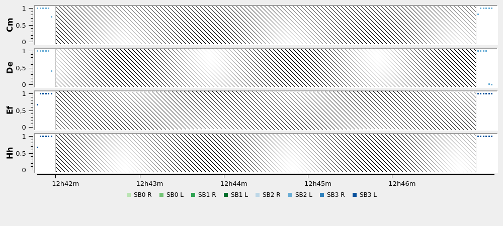
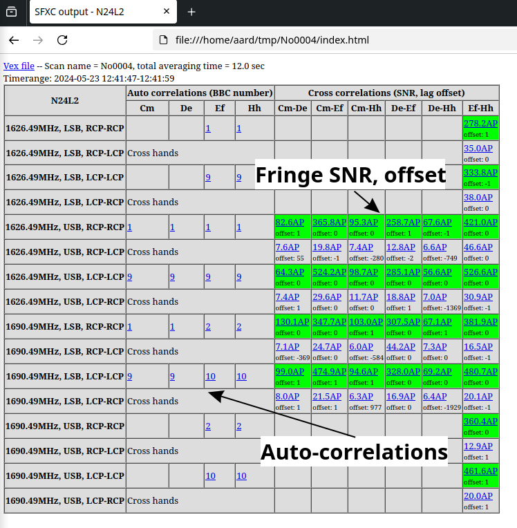
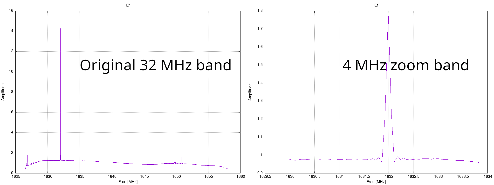

<!-- MathJax -->
<script src="https://cdnjs.cloudflare.com/ajax/libs/mathjax/2.7.7/MathJax.js?config=TeX-AMS-MML_HTMLorMML" type="text/javascript"></script> 
<script type="text/x-mathjax-config">
    MathJax.Hub.Config({
      tex2jax: {
        skipTags: ['script', 'noscript', 'style', 'textarea', 'pre'],
        inlineMath: [['$','$']],
        displayMath: [['$$','$$']]
      }
    });
</script>  

<script type="text/javascript">
var pcs = document.lastModified.split(" ")[0].split("/");
var date = pcs[1] + '/' + pcs[0] + '/' + pcs[2];
onload = function(){
    document.getElementById("lastModified").innerHTML = "Page last modified on " + date;
}
		</script>

<link href="styles.css" rel="stylesheet" />

<!-- Prism CSS -->
<link rel="stylesheet" href="https://cdnjs.cloudflare.com/ajax/libs/prism/1.29.0/themes/prism.min.css" />
<link id="prism-dark" rel="stylesheet" href="https://cdnjs.cloudflare.com/ajax/libs/prism/1.29.0/themes/prism-tomorrow.min.css" disabled />
<link rel="stylesheet" href="https://cdnjs.cloudflare.com/ajax/libs/prism/1.29.0/plugins/line-numbers/prism-line-numbers.min.css" />

<!-- Prism JS -->
<script src="https://cdnjs.cloudflare.com/ajax/libs/prism/1.29.0/prism.min.js"></script>
<script src="https://cdnjs.cloudflare.com/ajax/libs/prism/1.29.0/components/prism-python.min.js"></script>
<script src="https://cdnjs.cloudflare.com/ajax/libs/prism/1.29.0/plugins/line-numbers/prism-line-numbers.min.js"></script>

[Return to the homepage](index.md)
# SFXC workshop 2025 • SFXC Tutorial


## On this page
1. [Introduction](#introduction)
2. [Optional: Install SFXC](#sfxc-install)
3. [Data download](#data-download)
4. [Create vex file](#prepare-vex)
5. [Create control file](#prepare-ctrl)
6. [Run correlation](#run-sfxc)
7. [Clock searching](#clock-searching)
7. [Advanced: zoom bands](#zoom-band)

### Resources
- [Control file reference](control-file-parameters.md)
- [VEX standard](https://vlbi.org/vlbi-standards/vex/)

## Introduction

In this tutorial we will go through all the steps required to correlate a simple experiment.  This entails the following steps:
- create a vex file suitable for SFXC
- create a correlator control file
- clock search the experiment
- do the final correlation

We will also inspect the correlator output using tool from the SFXC distribution.  Converting this data to
FITS for use with AIPS or CASA will be subject of a later tutorial.

In the final section of this tutorial we will show how to create zoom bands in SFXC.

## Optional: Install SFXC

This step is only necessary when this tutorial is followed on your hardware, SFXC is already installed on the workshop cluster.

The current prerequisites for SFXC on a recent Debian based system (like Ubuntu) are

```bash
apt-get install -y python3 python3-pip build-essential git flex bison \
                   openmpi-bin libopenmpi-dev python-is-python3 \
                   libfftw3-dev libgsl-dev gfortran-multilib g++-multilib
```

The source code can be downloaded using
```bash
git clone https://code.jive.eu/JIVE/sfxc.git
```

The program can then installed using
```bash
cd sfxc
./compile.sh
./configure
make
sudo make install
```
Optionally, SFXC can use the Intel Performance Primitives (IPP) library which will result in a significant performance gain.
```
./configure --enable-ipp --with-ipp-path=PATH
```

Many of the scripts in SFXC require our vex parser which can be installed system wide using
```bash
cd ../vex
python setup.py build
sudo python setup.py install
```
Alternatively, the vex parser can also be installed using pip
```bash
cd ../vex
pip install .
```

## Data download

### Workshop cluster

On the cluster the data for the tutorial is located in `/data/n24l2/files/`

### Local install

When doing this tutorial on your own hardware the data for the tutorial can be downloaded using this command:

```bash
wget -r -nd https://archive.jive.eu/sfxc-workshop/n24l2/ -A "n24l2*"
```
or by manually downloading the files from `https://archive.jive.eu/sfxc-workshop/n24l2/` using a web browser.

## Create vex file
While vex files drive both the correlator and observing stations, the vex files created by 
scheduling software such as `sched` or `pysched` don't contain all the information needed 
by the correlator. For example, it is missing the `$CLOCKS` and `$EOP` sections as these are 
not known at time of scheduling. Furthermore, it is missing the appropriate `$THREADS`,  and or
`$BITSTREAMS` sections as stations do not use this information directly.

In the SFXC distribution there is a program called `prepare_vex.py` which take an observing vex 
file created by `(py)sched` and adds these missing sections to the vex file. It will
- Add a `$CLOCKS` section with all delays and rates set to zero
- Fetch EOP information from the [internet](ftps://gdc.cddis.eosdis.nasa.gov/vlbi/gsfc/ancillary/solve_apriori/usno_finals.erp) and create an `$EOP` section
- Create `$THREADS` based on a set of heuristics, these heuristics know about the standard 
thread mappings of the DBBC2 (i.e. most EVN stations), VLBA, KVN, and e-merlin out-stations.
However, because these are simply a set of heuristics it is possible that it will produce
an incorrect `$THREADS` mapping. Furthermore, the script will not create `$BITSTREAMS` sections.

We will use the vex file `n24l2.vex` as our starting point (located in `/data/n24l2/files/`), the `$MODE` block from this vex file
is shown below. Note that there are no `$THREADS` sections, but there are `$TRACKS` sections defined
which, unfortunately, no longer contain useful information for most stations. Also note, though not referenced
in the `$MODE` section, in this vex file there are no `$EOP`, and `$CLOCKS` sections.
```
def sess224.L1024;
     ref $PROCEDURES = Mode_01;
     ref $FREQ = 1626.49MHz8x32MHz:Jb:Wb:Ef:Mc:Nt:O8:Tr:Hh:Ir;
     ref $FREQ = 1626.49MHz2x64MHz:Cm:Da:Kn:Pi:De;
     ref $IF = LO@2272MHzDPolNoTone:Jb;
     ref $IF = LO@1247MHzDPolNoTone:Wb;
     ref $IF = LO@1510MHzDPolNoTone:Ef;
     ref $IF = LO@1295MHzDPolNoTone:Mc;
     ref $IF = LO@1279MHzDPolNoTone:Nt;
     ref $IF = LO@730MHzDPolNoTone:O8;
     ref $IF = LO@2300MHzDPolNoTone:Tr;
     ref $IF = LO@1510MHzDPolNoTone#02:Hh;
     ref $IF = LO@1350MHzDPolNoTone:Ir;
     ref $IF = LO@2272MHzDPolNoTone#02:Cm:Da:Kn:Pi:De;
     ref $BBC = 8BBCs#02:Jb:Wb:Tr;
     ref $BBC = 8BBCs:Ef;
     ref $BBC = 8BBCs#03:Mc:O8:Hh;
     ref $BBC = 8BBCs#04:Nt;
     ref $BBC = 8BBCs#05:Ir;
     ref $BBC = 2BBCs:Cm:Da:Kn:Pi:De;
     ref $TRACKS = VDIF.8Ch2bit1to1:Jb:Wb:Ef:Mc:Nt:O8:Tr:Hh:Ir;
     ref $TRACKS = VDIF.2Ch2bit1to1:Cm:Da:Kn:Pi:De;
*    ref $HEAD_POS = DiskVoid <= obsolete definition
     ref $ROLL = NoRoll:Jb:Wb:Ef:Mc:Nt:O8:Tr:Hh:Ir:Cm:Da:Kn:Pi:De;
*    ref $PASS_ORDER = DiskVoid <= obsolete definition
     ref $PHASE_CAL_DETECT = NoDetect:Jb:Wb:Ef:Mc:Nt:O8:Tr:Hh:Ir;
     ref $PHASE_CAL_DETECT = NoDetect#02:Cm:Da:Kn:Pi:De;
enddef;
```

We add the missing section using,

```bash
prepare_vex.py n24l2.vex n24l2.vix
```

Inspecting the resulting vex file (n24l2.vix) shows that the script added `$THREADS` to
the `$MODE` block,

```
$MODE;
*
def sess224.L1024;
    ref $THREADS = THREADS.sess224.L1024.Jb:Jb:Tr;
    ref $THREADS = THREADS.sess224.L1024.Wb:Wb;
    ref $THREADS = THREADS.sess224.L1024.Ef:Ef;
    ref $THREADS = THREADS.sess224.L1024.Mc:Mc:O8:Hh;
    ref $THREADS = THREADS.sess224.L1024.Nt:Nt;
    ref $THREADS = THREADS.sess224.L1024.Ir:Ir;
    ref $THREADS = THREADS.sess224.L1024.Cm:Cm:Da:Kn:Pi:De;
    ref $PROCEDURES = Mode_01;
    ....
```

Furthermore it created an initial `$CLOCKS` section and an `$EOP` section. Note that because
the earth rotation parameters are continuously updated, the values in the `$EOP` section may 
still change significantly in the first week after observation.

```
$EOP;
def theEOP;
    TAI-UTC = 37 sec;
    eop_ref_epoch = 2024y143d00h00m00s;
    eop_interval = 24 hr;
    num_eop_points = 3;
    x_wobble = 0.024770 asec : 0.026104 asec : 0.026822 asec;
    y_wobble = 0.434034 asec : 0.435695 asec : 0.437506 asec;
    ut1-utc = -0.0213353 sec : -0.0213183 sec : -0.0211052 sec;
enddef;
```

## Create control file

Now that we have a basic vex file we need to create a control file needed to run SFXC. This file
contain all the correlation parameters such as integration time, number of spectral channels,
locations of data files, etc.

A complete documentation of the control file can be found [here](control-file-parameters.md)

In the SFXC distribution there is a script called `generate_jobs.py` that can be used to create a control file,
it has a large number of options:

``` bash
generate_jobs.py -h
```

The data files for n24l2 on the cluster are (located in `/data/n24l2/files/`)
```
n24l2_cm_no0004.vdif  n24l2_cm_no0005.vdif  
n24l2_de_no0004.vdif  n24l2_de_no0005.vdif
n24l2_ef_no0004  n24l2_ef_no0005
n24l2_hh_no0004  n24l2_hh_no0005
```

For each station (Cm, De, Ef, and Hh) there is data for two scans (scan 4 and 5).

A control file for these these two scans can be created using the command
``` bash
generate_jobs.py n24l2.vix -a 4,5 -n 2 -s Cm,De,Ef,Hh -C -c 1024 -i 2.0
```
Lets unpack this command:
  * `-a 4,5`, generate control file only for scans 4 and 5 
  * `-n 2`, by default ``generate_jobs.py`` will create separate control files for each scan, this option tells the script to put two scan into the same control file
  * `-s Cm,De,Ef,Hh`, select which stations to use, default would be all stations
  * `-C`, enabled the correlation of the cross-polarisations (RCP vs LCP and vice versa)
  * `-c 1024`, set the number of spectral channels to 1024 in the output file
  * `-i 2.0`, set the integration time to two seconds

This results in the following control file
``` yaml
{
    "data_sources": {
        "Cm": [
            "mk5://FLXBFFCm:0"
        ],
        "De": [
            "mk5://FLXBFFDe:0"
        ],
        "Ef": [
            "mk5://FLXBFFEf:0"
        ],
        "Hh": [
            "mk5://FLXBFFHh:0"
        ]
    },
    "start": "2024y144d12h32m00s",
    "stop": "2024y144d12h57m00s",
    "stations": [
        "Cm",
        "De",
        "Ef",
        "Hh"
    ],
    "channels": [
        "CH01",
        "CH02"
    ],
    "number_channels": 1024,
    "integr_time": 2.0,
    "exper_name": "N24L2",
    "output_file": "file:///home/<workshopID>/data/n24l2-test/n24l2_no0004.cor",
    "delay_directory": "file:///home/<workshopID>/data/n24l2-test/delays",
    "cross_polarize": true,
    "message_level": 1
}
```
In this control file we still have to populate the `data_sources` section. But also note there are only two channels selected in this control file: CH01, and CH02.
Inspecting the `$FREQ` section of the vex file shows that Cm, and De have two 64 MHz wide channels defined. While Ef, and Hh have eight 32 MHz channels defined.
When no setup station is defined, SFXC will select the first station in the `stations` list as setup station, which is Cm in this case. 

In this case, of course, Cm and De only observed half the total bandwidth of the other stations. So it would make sense to select e.g. Ef as the setup station
to correlate all available data. However, this is not the only reason. When correlating a wider band against a number of bands with that have a smaller bandwidth, 
the correlator will correlate each wider band against a single narrow band. So in this case each 64 MHz is correlated against one 32 MHz band, the remaining 50% of 
the band will be filled with zeros.

Therefore we should, in almost all cases, select the station with the most narrow bandwidth as the setup station, in this case we use Ef
```bash
generate_jobs.py n24l2.vix -a 4,5 -n 2 -s Cm,De,Ef,Hh -C -c 1024 -i 2 -S Ef
```

The control file will now contain the eight channels defined for station Ef, and an entry for the setup station.

We can now add the data sources, this is just the absolute paths of the files prepended with `file://`

``` yaml
{
    "setup_station": "Ef",
    "data_sources": {
        "Cm": [
            "file:///data/n24l2/files/n24l2_cm_no0004.vdif",
            "file:///data/n24l2/files/n24l2_cm_no0005.vdif"
        ],
        "De": [
            "file:///data/n24l2/files/n24l2_de_no0004.vdif",
            "file:///data/n24l2/files/n24l2_de_no0005.vdif"
        ],
        "Ef": [
            "file:///data/n24l2/files/n24l2_ef_no0004",
            "file:///data/n24l2/files/n24l2_ef_no0005"
        ],
        "Hh": [
            "file:///data/n24l2/files/n24l2_hh_no0004",
            "file:///data/n24l2/files/n24l2_hh_no0005"
        ]
    },
    "start": "2024y144d12h41m47s",
    "stop": "2024y144d12h47m10s",
    "stations": [
        "Cm",
        "De",
        "Ef",
        "Hh"
    ],
    "channels": [
        "CH01",
        "CH02",
        "CH03",
        "CH04",
        "CH05",
        "CH06",
        "CH07",
        "CH08"
    ],
    "number_channels": 1024,
    "integr_time": 2,
    "exper_name": "N24L2",
    "output_file": "file:///home/<workshopID>/data/n24l2/n24l2_no0004.cor",
    "delay_directory": "file:///home/<workshopID>/data/n24l2/delays",
    "cross_polarize": true,
    "message_level": 1
}
```

The start- and stop times in the above control file are the start of scan no0004 and the end of scan no0005 respectively.
However, we have only some short snippets of data, so we would like to modify the start- and stop times to only include the
time ranges for which we have data.

The raw VDIF data can be inspected using the tool `vdif_print_headers`. For Mark5B and Mark5A data there are similar tools: `mark5a_print_headers`, and `mark5b_print_headers`.

Lets have a look at the first data file for Ef (the most sensitive station in the array)
```bash
vdif_print_headers /data/n24l2/files/n24l2_ef_no0004 | less
```

The output shows that this data starts at 2024y144d12h41m47.000s, starting a frame number 10422. So if we start the correlation at 2024y144d12h41m47.000s,
we don't expect full weights for the first integration.
```
2024y144d12h41m47.000s ,frame_nr = 10422, thread_id = 0, nchan = 8, invalid = 0, legacy = 0, station = NA, complex = 0, bps-1 = 1, data_size = 8032
2024y144d12h41m47.000s ,frame_nr = 10423, thread_id = 0, nchan = 8, invalid = 0, legacy = 0, station = NA, complex = 0, bps-1 = 1, data_size = 8032
2024y144d12h41m47.000s ,frame_nr = 10424, thread_id = 0, nchan = 8, invalid = 0, legacy = 0, station = NA, complex = 0, bps-1 = 1, data_size = 8032
2024y144d12h41m47.000s ,frame_nr = 10425, thread_id = 0, nchan = 8, invalid = 0, legacy = 0, station = NA, complex = 0, bps-1 = 1, data_size = 8032
```

We can do a similar inspection for the other data file `/data/n24l2/files/n24l2_ef_no0005`, this shows that this file ends at 2024y144d12h47m13.000s.

Looking at VDIF files using this tool is also a way to find out what the exact data format was. 
In this case there is only a single VDIF thread (`thread_id = 0`), containing 8 channels per frame (`nchan = 8`),
matching what is in the `$THREADS` section of the vex file. VDIF frames can also be marked as invalid, in that case `invalid = 1`. 
Invalid frames are flagged by the correlator and their data replaced with zeros.

Inspecting the first data file for station Cm shows
```
2024y144d12h41m41.000s ,frame_nr = 3118, thread_id = 0, nchan = 1, invalid = 0, legacy = 0, station = Cm, complex = 0, bps-1 = 1, data_size = 8032
2024y144d12h41m41.000s ,frame_nr = 3118, thread_id = 1, nchan = 1, invalid = 0, legacy = 0, station = Cm, complex = 0, bps-1 = 1, data_size = 8032
2024y144d12h41m41.000s ,frame_nr = 3119, thread_id = 1, nchan = 1, invalid = 0, legacy = 0, station = Cm, complex = 0, bps-1 = 1, data_size = 8032
2024y144d12h41m41.000s ,frame_nr = 3119, thread_id = 0, nchan = 1, invalid = 0, legacy = 0, station = Cm, complex = 0, bps-1 = 1, data_size = 8032
```
This file contains two VDIF threads, with each thread containing a single channel. This again matches what is in the vex file.  
However, a common failure mode is that the `thread_id` in the data does not match the `thread_id` which is in the `$THREADS` section of the vex file.
Below we can see that in this case they match (the `thread_id` is the first number in the `thread = ` statements). But if the correlator assigns zero
weights for one or more channels while the start times of the correlation is correct it is likely that the `thread_id` was wrong in the vex file.

```
def THREADS.sess224.L1024.Cm;
    format = vdif :   : 512;
    thread = 0 : 1 : 1 : 256 : 1 : 2 :   :   : 8000;
    thread = 1 : 1 : 1 : 256 : 1 : 2 :   :   : 8000;
    channel = CH01 : 1 : 0;
    channel = CH02 : 0 : 0;
enddef;
```

## Run the correlator

### Generating the delay model
The SFXC delay generation program needs a number of data files which are part
of SFXC distribution. In the source code distribution they located in `sfxc/lib/calc10/data`. On our cluster we
have put these files in the director `/opt/sfxc/calc`. 

SFXC needs the environment variable `$CALC_DIR` to point to the directory containing these files
On the cluster add the following line to `$HOME/.profile`
```bash
export CALC_DIR=/opt/sfxc/calc
```

Also note that in the control file we created in the previous section we defined a location where SFXC will look for delay files
```yaml
    "delay_directory": "file:///home/<workshopID>/data/n24l2/delays",
```
Before running the correlator we need to ensure this directory exists
```bash
mkdir -p /home/<workshopID>/data/n24l2/delays
```
We can now decide if we let SFXC create the delay files or if we do this manually.
While SFXC will create delay files if these don't exists already, it is quite slow because does the delay generation is done in a single thread.
It is faster to use the script `gen_all_delay_tables.py` which uses multi threading
```
gen_all_delay_tables.py n24l2.vix n24l2_no0004.ctrl
```

### Initial correlation

Run the initial correlation on the cluster as such
```bash
srun --mpi pmix -n 28 /opt/sfxc/bin/sfxc n24l2_no0004.ctrl n24l2.vix 2>&1 | tee n24l2_no0004.log
```
or when running on your own hardware
```
mpirun -n 12 --oversubscribe `which sfxc` n24l2_no0004.ctrl n24l2.vix 2>&1 | tee n24l2_no0004.log
```
During the correlation SFXC will output various useful messages to the console, in the example this output is saved in `n24l2_no0004.log`.

For example SFXC will print the start times of each data file
```
Inode-Ef (sfxc-e1, Rank = 5): Start of VDIF data at jday=60453, seconds in epoch = 12400907, epoch=48, t=2024y144d12h41m47.652s
Inode-De (sfxc-e1, Rank = 4): Start of VDIF data at jday=60453, seconds in epoch = 233239301, epoch=34, t=2024y144d12h41m41.096s
Inode-Cm (sfxc-e1, Rank = 3): Start of VDIF data at jday=60453, seconds in epoch = 233239301, epoch=34, t=2024y144d12h41m41.779s
Inode-Hh (sfxc-e1, Rank = 6): Start of VDIF data at jday=60453, seconds in epoch = 12400907, epoch=48, t=2024y144d12h41m47.653s
```
It will also print which integrations it is correlating
```
10h03m34.446s, 00, START_TIME: 2024y144d12h41m47.000s                                                                                                                                                          
10h03m34.446s, 00, start 2024y144d12h41m47.000s, slice 0, channel 0,1 to correlation node 1                                                                                                                    
10h03m34.448s, 00, start 2024y144d12h41m47.000s, slice 0, channel 2,3 to correlation node 3                                                                                                                    
10h03m34.451s, 00, start 2024y144d12h41m47.000s, slice 0, channel 4,5 to correlation node 5                                                                                                                    
10h03m34.455s, 00, start 2024y144d12h41m47.000s, slice 0, channel 6,7 to correlation node 7                                                                                                                    
```

A quick inspection of the correlated data can be done using the tool `print_corfile.py`
```bash
print_corfile.py n24l2_no0004.cor | less
```

The output may be a bit confusing at first but it contains a lot of useful information. The first lines show
the global header of the output file and the sampler statistics of the first integration
```
SFXC version = 2147483647, branch = GIT, correlator_version = master-0-g0e7d614d, jobnr = 0, subjobnr = 0
Experiment N24L2, date = 2024y144d12h41m47s, int_time = 2000000, nchan = 1024, polarization = LL+RR+LR+RL
Stations = Cm, Da, De, Ef, Hh, Ir, Jb, Kn, Mc, Nt, O8, Pi, Tr, Wb
Sources = J0442-0017, J0854+2006
---------- time slice 0, t = 2024y144d12h41m47.000000s ---------
Station Ef
freq = 0, sb = 0, pol = 0, levels: -- 0.130, -+ 0.200, +- 0.205, ++ 0.133, invalid 0.332
freq = 0, sb = 0, pol = 1, levels: -- 0.115, -+ 0.218, +- 0.219, ++ 0.116, invalid 0.332
freq = 0, sb = 1, pol = 0, levels: -- 0.120, -+ 0.213, +- 0.214, ++ 0.121, invalid 0.332
freq = 0, sb = 1, pol = 1, levels: -- 0.121, -+ 0.212, +- 0.213, ++ 0.121, invalid 0.332
freq = 1, sb = 0, pol = 0, levels: -- 0.105, -+ 0.230, +- 0.140, ++ 0.193, invalid 0.332
freq = 1, sb = 0, pol = 1, levels: -- 0.093, -+ 0.239, +- 0.150, ++ 0.185, invalid 0.332
freq = 1, sb = 1, pol = 0, levels: -- 0.120, -+ 0.214, +- 0.212, ++ 0.121, invalid 0.332
freq = 1, sb = 1, pol = 1, levels: -- 0.119, -+ 0.215, +- 0.215, ++ 0.119, invalid 0.332
```
This output shows the sampler statics for station Ef. Here `freq` refers to the channel 
frequency listed in the `$FREQ` section of the vex file, sb is the
side-band where `sb=0` is lower side-band, and `sb=1` is upper side-band. And `pol=0` means RCP, while `pol=1` means LCP.

As the data is quantised using 2 bits, there are 4 different levels a sample can have.
The numbers show the total fraction of samples that had a certain state in an integration. 
Thus adding up all the levels will result in 1.0. Missing data is labelled as invalid. 
So in this integration (like we predicted in the previous section) 33.2% of the data is missing for Ef.

Looking at the sampler stats for Cm we see that this station had an sub-optimal sampling, as the states --, and ++ are not used. This will
reduce the signal-to-noise ratio.
```
Station Cm
freq = 0, sb = 1, pol = 0, levels: -- 0.000, -+ 0.502, +- 0.498, ++ 0.000, invalid 0.000
freq = 0, sb = 1, pol = 1, levels: -- 0.000, -+ 0.500, +- 0.500, ++ 0.000, invalid 0.000
freq = 1, sb = 0, pol = 0, levels: -- 0.000, -+ 0.502, +- 0.498, ++ 0.000, invalid 0.000
freq = 1, sb = 0, pol = 1, levels: -- 0.000, -+ 0.500, +- 0.500, ++ 0.000, invalid 0.000
```

Scrolling down in the output we come to the part where the baseline detections are shown
```
Baseline: station1 = Cm, station2 = De
freq = 0, sb = 1, pol = 0, fringe ampl = 0.001588, SNR = 34.949120, offset = 3, weight = 127998976.000000
freq = 0, sb = 1, pol = 2, fringe ampl = 0.000284, SNR = 5.686690, offset = 80, weight = 127998976.000000
freq = 0, sb = 1, pol = 1, fringe ampl = 0.000322, SNR = 6.404883, offset = 132, weight = 127998976.000000
freq = 0, sb = 1, pol = 3, fringe ampl = 0.001241, SNR = 29.898475, offset = 2, weight = 127998976.000000
freq = 1, sb = 0, pol = 0, fringe ampl = 0.002344, SNR = 56.372927, offset = 2, weight = 127998976.000000
freq = 1, sb = 0, pol = 2, fringe ampl = 0.000283, SNR = 5.898193, offset = -12, weight = 127998976.000000
freq = 1, sb = 0, pol = 1, fringe ampl = 0.000364, SNR = 8.307779, offset = 3, weight = 127998976.000000
freq = 1, sb = 0, pol = 3, fringe ampl = 0.001270, SNR = 30.391033, offset = 1, weight = 127998976.000000
Baseline: station1 = Cm, station2 = Ef
freq = 0, sb = 1, pol = 0, fringe ampl = 0.000384, SNR = 7.025609, offset = -182, weight = 85444528.000000
freq = 0, sb = 1, pol = 1, fringe ampl = 0.000345, SNR = 6.215631, offset = -148, weight = 85444528.000000
freq = 0, sb = 1, pol = 2, fringe ampl = 0.000367, SNR = 6.976994, offset = 122, weight = 85444528.000000
freq = 0, sb = 1, pol = 3, fringe ampl = 0.000353, SNR = 6.320083, offset = -97, weight = 85444528.000000
freq = 1, sb = 0, pol = 0, fringe ampl = 0.000349, SNR = 6.429329, offset = 124, weight = 85444528.000000
freq = 1, sb = 0, pol = 1, fringe ampl = 0.000315, SNR = 5.603886, offset = -248, weight = 85444528.000000
freq = 1, sb = 0, pol = 2, fringe ampl = 0.000382, SNR = 6.696422, offset = 260, weight = 85444528.000000
freq = 1, sb = 0, pol = 3, fringe ampl = 0.000314, SNR = 4.935712, offset = -403, weight = 85444528.000000
```
Here `freq` and `sb` have the same meaning as earlier, but `pol` now refers to which cross-polarisation
product is being shown. There are four different possibilities
  - `pol=0` RCP - RCP
  - `pol=1` LCP - RCP
  - `pol=2` RCP - LCP
  - `pol=3` LCP - LCP

Meaning that `pol=1`, and `pol=2` are the cross-polarisation products, which we expect to have a low SNR. 
When troubleshooting an experiment you may sometimes find that the cross-polarisation have a strong fringe while 
the parallel hands are weak. In that case the station likely swapped the two polarisation, which is easily rectified
in the vex file.

The output shows the fringe amplitude, SNR, and how many lags the fringe is offset from the centre. Ideally, the offset
should be close to zero.

We see that there is a fringe between Cm and De, but not between Cm and Ef. In this tool `SNRs < 10` should not be trusted as detections.
Scrolling down the file we see that there is also no fringe to Hh. 

### Increase the number of channels

Because we didn't get a detection to all stations using 1024 channels, the first thing to try in this case is to 
widen the search window by increasing the number of channels.
We try again with 8192 channels. The setup station (Ef) uses a sample rate of 64M samples / s, meaning
that there are 64 samples / µs, and therefore 8192 channels will search a window of +/- 128 µs (8192 / 64).

Edit the file `n24l2_no0004.ctrl` and change the `number_channels` parameter
```yaml
  "number_channels": 8192,
```
Run the correlation again
```bash
srun --mpi pmix -n 28 /opt/sfxc/bin/sfxc n24l2_no0004.ctrl n24l2.vix 2>&1 | tee n24l2_no0004.log
```

Inspecting the output again using `print_corfile.py` shows that we now have a detection to all stations.
```
Baseline: station1 = Cm, station2 = Ef
freq = 0, sb = 1, pol = 0, fringe ampl = 0.007656, SNR = 146.608752, offset = -3147, weight = 85429168.000000
freq = 0, sb = 1, pol = 1, fringe ampl = 0.000728, SNR = 12.879272, offset = -3147, weight = 85429168.000000
freq = 0, sb = 1, pol = 2, fringe ampl = 0.000382, SNR = 6.563517, offset = -3147, weight = 85429168.000000
freq = 0, sb = 1, pol = 3, fringe ampl = 0.006812, SNR = 135.019158, offset = -3147, weight = 85429168.000000
freq = 1, sb = 0, pol = 0, fringe ampl = 0.006615, SNR = 129.276691, offset = -3148, weight = 85429168.000000
freq = 1, sb = 0, pol = 1, fringe ampl = 0.000434, SNR = 7.474085, offset = -3147, weight = 85429168.000000
freq = 1, sb = 0, pol = 2, fringe ampl = 0.000392, SNR = 6.601558, offset = -3148, weight = 85429168.000000
freq = 1, sb = 0, pol = 3, fringe ampl = 0.005867, SNR = 111.174741, offset = -3148, weight = 85429168.000000
Baseline: station1 = Cm, station2 = Hh
freq = 0, sb = 1, pol = 0, fringe ampl = 0.001629, SNR = 28.317692, offset = -1098, weight = 85086536.000000
freq = 0, sb = 1, pol = 1, fringe ampl = 0.000472, SNR = 7.923055, offset = 107, weight = 85086536.000000
freq = 0, sb = 1, pol = 2, fringe ampl = 0.000391, SNR = 6.833774, offset = -921, weight = 85086536.000000
freq = 0, sb = 1, pol = 3, fringe ampl = 0.001990, SNR = 39.785343, offset = -1098, weight = 85086536.000000
freq = 1, sb = 0, pol = 0, fringe ampl = 0.001788, SNR = 35.016420, offset = -1099, weight = 85086536.000000
freq = 1, sb = 0, pol = 1, fringe ampl = 0.000407, SNR = 7.114792, offset = -1345, weight = 85086536.000000
freq = 1, sb = 0, pol = 2, fringe ampl = 0.000491, SNR = 8.822408, offset = -397, weight = 85086536.000000
freq = 1, sb = 0, pol = 3, fringe ampl = 0.001904, SNR = 36.784082, offset = -1098, weight = 85086536.000000
Baseline: station1 = De, station2 = Ef
freq = 0, sb = 1, pol = 0, fringe ampl = 0.005399, SNR = 105.065228, offset = -3150, weight = 85429168.000000
freq = 0, sb = 1, pol = 1, fringe ampl = 0.000493, SNR = 8.579212, offset = -3148, weight = 85429168.000000
freq = 0, sb = 1, pol = 2, fringe ampl = 0.000427, SNR = 7.402058, offset = -994, weight = 85429168.000000
freq = 0, sb = 1, pol = 3, fringe ampl = 0.005489, SNR = 106.731878, offset = -3149, weight = 85429168.000000
freq = 1, sb = 0, pol = 0, fringe ampl = 0.006401, SNR = 122.769674, offset = -3149, weight = 85429168.000000
```

## Clock searching

In the previous section we found a detection to all stations using 8192 channels. We can now find the clock offsets
to each station. For this we use a program called `simple_fit.py`.

```bash
simple_fit.py -c n24l2_no0004.ctrl n24l2.vix Ef | tee clocks.json
```

This will find the clocks using Ef as the reference, meaning that all clock offsets are computed relative to Ef.
In this example we save the output to clocks.json as we will need this output in the next step

```yaml
{
"stations" : [ "Cm",  "De",  "Ef",  "Hh"],
"channels" : [ "CH01",  "CH02",  "CH03",  "CH04",  "CH05",  "CH06",  "CH07",  "CH08"],
"epoch" : "2024y144d12h41m53s",
"clocks" : {
    "Cm" : {
        "CH01" : [-0.0, 0.0, 0.0, 3.471140667177302e-18],
        "CH02" : [-0.0, 0.0, 0.0, 3.471140667177302e-18],
        "CH03" : [-49.172278563052465, -1.17939257613287e-06, 191.37326771260638, 0.24999993750001562],
        "CH04" : [-49.18159735080828, -1.4408588195908837e-06, 163.94933561412557, 0.24999993750001562],
        "CH05" : [-49.17787223273052, -1.4733209833082077e-06, 166.4273691570709, 0.24999993750001562],
        "CH06" : [-49.186061278143505, -1.187879037605879e-06, 139.4667184450833, 0.24999993750001562],
        "CH07" : [-0.0, -0.0, 0.0, 3.471140667177302e-18],
        "CH08" : [-0.0, -0.0, 0.0, 3.471140667177302e-18]
    },
    "De" : {
        "CH01" : [-0.0, 0.0, 0.0, 3.471140667177302e-18],
        "CH02" : [-0.0, 0.0, 0.0, 3.471140667177302e-18],
        "CH03" : [-49.20609636260085, -2.52646660548359e-06, 110.19378983572537, 0.24999993750001562],
        "CH04" : [-49.20081883588331, -2.6810073530823195e-06, 111.57607262579211, 0.24999993750001562],
        "CH05" : [-49.21085211560799, -2.809070278524705e-06, 105.6326019297546, 0.24999993750001562],
        "CH06" : [-49.20382729027053, -2.261291339971913e-06, 106.16015854018227, 0.24999993750001562],
        "CH07" : [-0.0, -0.0, 0.0, 3.471140667177302e-18],
        "CH08" : [-0.0, -0.0, 0.0, 3.471140667177302e-18]
    },
    "Ef" : {
        "CH01" : [-0.0, 0.0, 0.0, 1.0],
        "CH02" : [-0.0, 0.0, 0.0, 1.0],
        "CH03" : [-0.0, -0.0, 0.0, 1.0],
        "CH04" : [-0.0, -0.0, 0.0, 1.0],
        "CH05" : [-0.0, 0.0, 0.0, 1.0],
        "CH06" : [-0.0, 0.0, 0.0, 1.0],
        "CH07" : [-0.0, -0.0, 0.0, 1.0],
        "CH08" : [-0.0, -0.0, 0.0, 1.0]
    },
    "Hh" : {
        "CH01" : [-32.02438712864055, -4.989223421547123e-06, 189.8475169014701, 0.12499998437500197],
        "CH02" : [-32.03337945619777, -4.676853823511988e-06, 118.61375273992688, 0.12499998437500197],
        "CH03" : [-32.01789859057739, -4.6072976975694996e-06, 232.1330587998478, 0.12499998437500197],
        "CH04" : [-32.02975743178576, -4.5580910890898835e-06, 155.32041392837596, 0.12499998437500197],
        "CH05" : [-32.019828818189346, -4.4198095557482186e-06, 162.8939119986934, 0.12499998437500197],
        "CH06" : [-32.03100004967475, -4.335725744173683e-06, 154.7430567983342, 0.12499998437500197],
        "CH07" : [-32.027399547034456, -4.129643588928883e-06, 212.10974715964647, 0.12499998437500197],
        "CH08" : [-32.037078148377425, -4.431165606440388e-06, 183.5886252154101, 0.12499998437500197]
    }
}
}
```
The structure of the output is as follows: `Channel_label : [clock offset (µs), clock rate (µs/s), SNR, Weight]`

So in the above output we found that station Hh had for CH01 a clock offset of -32.02438712864055 µs with an SNR
of 189.8475169014701.

Note that all clocks to Ef are zero because it is the reference. Also 50% of the channels are zero for Cm and Hh because
these stations only observed half the amount of bandwidth.

As these are very strong detections we can apply them using the `update_vex.py`
```
update_vex.py n24l2.vix n24l2.clk.vix clocks.json
```
This results in a new vex file n24l2.clk.vix, which has all clocks filled in
```
$CLOCK;
def Cm;
    clock_early =  2024y144d12h00m00s :  -49.1833 usec :  2024y144d13h30m00s  :  -1.320e-06 usec/sec; * Modified on 2025-09-19 10:34:47
*     clock_early = 2024y144d12h00m00s : 0.0000 usec : 2024y144d13h30m00s : 0.0000 usec/sec;
enddef;
def Da;
    clock_early = 2024y144d12h00m00s : 0.0000 usec : 2024y144d13h30m00s : 0.0000 usec/sec;
enddef;
def De;
    clock_early =  2024y144d12h00m00s :  -49.2128 usec :  2024y144d13h30m00s  :  -2.569e-06 usec/sec; * Modified on 2025-09-19 10:34:47
*     clock_early = 2024y144d12h00m00s : 0.0000 usec : 2024y144d13h30m00s : 0.0000 usec/sec;
enddef;
def Ef;
    clock_early =  2024y144d12h00m00s :  0.0000 usec :  2024y144d13h30m00s  :  0.000e+00 usec/sec; * Modified on 2025-09-19 10:34:47
*     clock_early = 2024y144d12h00m00s : 0.0000 usec : 2024y144d13h30m00s : 0.0000 usec/sec;
enddef;
def Hh;
    clock_early =  2024y144d12h00m00s :  -32.0406 usec :  2024y144d13h30m00s  :  -4.518e-06 usec/sec; * Modified on 2025-09-19 10:34:47
*     clock_early = 2024y144d12h00m00s : 0.0000 usec : 2024y144d13h30m00s : 0.0000 usec/sec;
enddef;
```

A word of warning though, in this case we applied the clock rates as found by `simple_fit.py`, however, for most stations there will usually
be a clock rate (and clock offset) derived from GPS available. The clock rates from GPS are generally more accurate, as in this clock search
only a small time range is correlated. Furthermore, the clock rates the clock rate obtained by clock searching do not only measure the 
clock drift but are also affected by changes in local atmosphere above a station.

So in most cases, where there ere clock rates from GPS, we skip applying the delay rates in `update_vex.py` by using the option `-o`
```
update_vex.py -o n24l2.vix n24l2.norates.vix clocks.json
```

Re-correlating the experiment with the new clocks (which included the clock rates), and running `simple_fit.py` on the output
```bash
srun --mpi pmix -n 28 /opt/sfxc/bin/sfxc n24l2_no0004.ctrl n24l2.clk.vix 2>&1 | tee n24l2_no0004.log
simple_fit.py -c n24l2_no0004.ctrl n24l2.vix Ef 
```

This gives clock offsets that are close to zero
```yaml
{
"stations" : [ "Cm",  "De",  "Ef",  "Hh"],
"channels" : [ "CH01",  "CH02",  "CH03",  "CH04",  "CH05",  "CH06",  "CH07",  "CH08"],
"epoch" : "2024y144d12h41m53s",
"clocks" : {
    "Cm" : {
        "CH01" : [-0.0, 0.0, 0.0, 3.471140667177302e-18],
        "CH02" : [-0.0, 0.0, 0.0, 3.471140667177302e-18],
        "CH03" : [0.00724843311211544, 6.555089938975154e-10, 240.48780193835762, 0.24999993750001562],
        "CH04" : [-0.0020457050190313343, -1.706055037719957e-09, 265.38966872299017, 0.24999993750001562],
        "CH05" : [0.0016011981038108157, -3.857574870710403e-09, 190.11540041907722, 0.24999993750001562],
        "CH06" : [-0.006548817173737731, 6.180841807639466e-10, 264.375183391707, 0.24999993750001562],
        "CH07" : [-0.0, -0.0, 0.0, 3.471140667177302e-18],
        "CH08" : [-0.0, -0.0, 0.0, 3.471140667177302e-18]
    },
    "De" : {
        "CH01" : [-0.0, 0.0, 0.0, 3.471140667177302e-18],
        "CH02" : [-0.0, 0.0, 0.0, 3.471140667177302e-18],
        "CH03" : [-0.0006838868145107035, -2.256792929414462e-07, 143.83134369873878, 0.24999993750001562],
        "CH04" : [0.004572638882593529, -2.821303461660652e-07, 160.0302854554379, 0.24999993750001562],
        "CH05" : [-0.0054232943716390385, -3.432354533348089e-07, 217.88750089051854, 0.24999993750001562],
        "CH06" : [0.0016418859781595742, 1.6761388708923117e-09, 189.4597010358505, 0.24999993750001562],
        "CH07" : [-0.0, -0.0, 0.0, 3.471140667177302e-18],
        "CH08" : [-0.0, -0.0, 0.0, 3.471140667177302e-18]
    },
    "Ef" : {
        "CH01" : [-0.0, 0.0, 0.0, 1.0],
        "CH02" : [-0.0, 0.0, 0.0, 1.0],
        "CH03" : [-0.0, -0.0, 0.0, 1.0],
        "CH04" : [-0.0, -0.0, 0.0, 1.0],
        "CH05" : [-0.0, 0.0, 0.0, 1.0],
        "CH06" : [-0.0, 0.0, 0.0, 1.0],
        "CH07" : [-0.0, -0.0, 0.0, 1.0],
        "CH08" : [-0.0, -0.0, 0.0, 1.0]
    },
    "Hh" : {
        "CH01" : [0.0030574533306757714, -4.336384621175554e-07, 174.02388939077954, 0.12499998437500197],
        "CH02" : [-0.005882795448313114, -4.0262669920827057e-07, 196.87135983332217, 0.12499998437500197],
        "CH03" : [0.009574558442608025, -3.1883805958850813e-07, 218.05783150745876, 0.12499998437500197],
        "CH04" : [-0.00219384297999786, -1.746483758173351e-09, 243.17777988056275, 0.12499998437500197],
        "CH05" : [0.007696949337122717, 0.0, 171.67287883848834, 0.12499998437500197],
        "CH06" : [-0.0034978348326630496, 2.328164059295414e-09, 233.6561485503816, 0.12499998437500197],
        "CH07" : [0.00015663349226788093, 2.416176542424928e-09, 188.36609143231883, 0.12499998437500197],
        "CH08" : [-0.009532427272666934, 5.678715549355854e-10, 289.5170050148558, 0.12499998437500197]
    }
}
}
```

## Final correlation

Now that we have found the clocks we can reduce the number of spectral channels to a lower amount to get a
more reasonably size data set.

Set the number of channels to 64 in our control file
```yaml
  "number_channels": 64,
```

And run the correlator one more time
```bash
srun --mpi pmix -n 28 /opt/sfxc/bin/sfxc n24l2_no0004.ctrl n24l2.clk.vix 2>&1 | tee n24l2_no0004.log
```

Another useful diagnostic is plot the weights using the `weightplot.py`.

```bash
weightplot.py n24l2.clk.vix n24l2_no0004.ctrl
```
Note that this is a graphical application so it requires connecting with `ssh -X` to the cluster.

The output is a bit awkward because of the 5 minute gap between scans no0004 and no0005.
Weights equal to one means that there was no missing data. We see that in the first integration we 
were missing some data for Ef, and Hh. But also towards the end of our correlation run of scan no0005
there was some missing data for De.



<a name="fig-1">**Figure 1**</a> - *Weightplot of n24l2_no0004.ctrl*

A final diagnostic would be to create an html plot page.
```bash
produce_html_plotpage.py n24l2.clk.vix n24l2_no0004.ctrl
```
Note that when running this on your own hardware, the script requires `gnuplot` and the `gnuplotlib` python package.

The result is that for each of the two scans in the correlation it will create a web page showing things like
bandpasses, fringe SNR, sampler statistics, etc. The pages are located in directories No0004, and No0005.

Because the output is html you need to copy it to your local machine in order to view it
```bash
scp -r <workshopID>@sfxc-e0.sfxc.jive.nl:/home/<workshopID>/data/n24l2/No0004 .
scp -r <workshopID>@sfxc-e0.sfxc.jive.nl:/home/<workshopID>/data/n24l2/No0005 .
```

Viewing the index.html contained in these directories in a web browser shows



<a name="fig-2">**Figure 2**</a> - *FTP fringe plot page for scan No0004*

Running this script on a scan that is expected to to have
a strong detection is a good way to check for issues with in observation.

## Advanced: Zoom bands

Our example experiment is a boring continuum observation, but at Effelsberg (Ef) there is a strong RFI line aroun 1632 MHz. Lets pretend this is an interesting spectral line
rather than RFI and create a zoom band around this frequency. 

To create a zoom band we add a dummy station to the VEX file, lets call this station Qq. First we make a
copy of our original vex file
```bash
cp n24l2.clk.vix n24l2.zoom.vix 
```

Our new dummy station will need an `$IF`, `$BBC`, `$FREQ` section, where the `$FREQ` section contains a single channel
centred around our fake spectral line. 

Note that we don't create an entry in the $STATION section for the dummy station because then the dummy station would appear
in the correlator output. Whereas now there will be no reference to the dummy station in the output data at all.

We can simply reuse the `$IF`, and `$BBC` sections for one of the existing stations, lets use the sections from Ef. 
We will only have to create a new `$FREQ` section, which we'll call `FREQ-Qq`. This results in the following `$MODE` block:
```
$MODE;
*
def sess224.L1024;
    ref $THREADS = THREADS.sess224.L1024.Jb:Jb:Tr;
    ref $THREADS = THREADS.sess224.L1024.Wb:Wb;
    ref $THREADS = THREADS.sess224.L1024.Ef:Ef;
    ref $THREADS = THREADS.sess224.L1024.Mc:Mc:O8:Hh;
    ref $THREADS = THREADS.sess224.L1024.Nt:Nt;
    ref $THREADS = THREADS.sess224.L1024.Ir:Ir;
    ref $THREADS = THREADS.sess224.L1024.Cm:Cm:Da:Kn:Pi:De;
     ref $PROCEDURES = Mode_01;
     ref $FREQ = 1626.49MHz8x32MHz:Jb:Wb:Ef:Mc:Nt:O8:Tr:Hh:Ir;
     ref $FREQ = 1626.49MHz2x64MHz:Cm:Da:Kn:Pi:De;
     ref $FREQ = FREQ-Qq:Qq;
     ref $IF = LO@2272MHzDPolNoTone:Jb;
     ref $IF = LO@1247MHzDPolNoTone:Wb;
     ref $IF = LO@1510MHzDPolNoTone:Ef:Qq;
     ref $IF = LO@1295MHzDPolNoTone:Mc;
     ref $IF = LO@1279MHzDPolNoTone:Nt;
     ref $IF = LO@730MHzDPolNoTone:O8;
     ref $IF = LO@2300MHzDPolNoTone:Tr;
     ref $IF = LO@1510MHzDPolNoTone#02:Hh;
     ref $IF = LO@1350MHzDPolNoTone:Ir;
     ref $IF = LO@2272MHzDPolNoTone#02:Cm:Da:Kn:Pi:De;
     ref $BBC = 8BBCs#02:Jb:Wb:Tr;
     ref $BBC = 8BBCs:Ef:Qq;
     ref $BBC = 8BBCs#03:Mc:O8:Hh;
     ref $BBC = 8BBCs#04:Nt;
     ref $BBC = 8BBCs#05:Ir;
     ref $BBC = 2BBCs:Cm:Da:Kn:Pi:De;
     ref $TRACKS = VDIF.8Ch2bit1to1:Jb:Wb:Ef:Mc:Nt:O8:Tr:Hh:Ir;
     ref $TRACKS = VDIF.2Ch2bit1to1:Cm:Da:Kn:Pi:De;
*    ref $HEAD_POS = DiskVoid <= obsolete definition
     ref $ROLL = NoRoll:Jb:Wb:Ef:Mc:Nt:O8:Tr:Hh:Ir:Cm:Da:Kn:Pi:De;
*    ref $PASS_ORDER = DiskVoid <= obsolete definition
     ref $PHASE_CAL_DETECT = NoDetect:Jb:Wb:Ef:Mc:Nt:O8:Tr:Hh:Ir;
     ref $PHASE_CAL_DETECT = NoDetect#02:Cm:Da:Kn:Pi:De;
enddef; 
```

The `$FREQ` section, with a 4 MHz single channel centred around 1632 MHz
```
$FREQ;
*    
def FREQ-Qq;
* mode =  1    stations =Jb:Wb:Ef:Mc:Nt:O8:Tr:Hh:Ir
     sample_rate =    8.000 Ms/sec;  * (2bits/sample)
     chan_def = :  1629.99 MHz : U :  4.00 MHz : &CH01 : &BBC01 : &NoCal; *Rcp
     chan_def = :  1629.99 MHz : U :  4.00 MHz : &CH02 : &BBC09 : &NoCal; *Lcp
enddef;
```

The channel frequency 1629.99 was chosen because it is exactly 3.5 MHz from the band edge.
SFXC uses an FFT to cut the 4 MHz zoom band out of the original 32 MHz bands. This means that
the channel frequency needs to start exactly at an FFT point. This will be true as long as the FFT
is at least 64 points long in this case.

Now we've prepared the VEX file we need to create a control file, as a starting point we make a copy
of our previous control file.
```bash
cp n24l2_no0004.ctrl n24l2_zoom.ctrl
```

In this control file we set the `setup_station` to `Qq`, and select the two channels we just defined. We also
change the name of the output file to `n24l2_zoom.cor`.

```yaml
{
    "setup_station": "Qq",
    "data_sources": {
        "Cm": [
            "file:///data/n24l2/files/n24l2_cm_no0004.vdif",
            "file:///data/n24l2/files/n24l2_cm_no0005.vdif"
        ],
        "De": [
            "file:///data/n24l2/files/n24l2_de_no0004.vdif",
            "file:///data/n24l2/files/n24l2_de_no0005.vdif"
        ],
        "Ef": [
            "file:///data/n24l2/files/n24l2_ef_no0004",
            "file:///data/n24l2/files/n24l2_ef_no0005"
        ],
        "Hh": [
            "file:///data/n24l2/files/n24l2_hh_no0004",
            "file:///data/n24l2/files/n24l2_hh_no0005"
        ]
    },
    "start": "2024y144d12h41m47s",
    "stop": "2024y144d12h47m13s",
    "stations": [
        "Cm",
        "De",
        "Ef",
        "Hh"
    ],
    "channels": [
        "CH01",
        "CH02"    
    ],
    "number_channels": 64,
    "integr_time": 2.0,
    "exper_name": "N24L2",
    "output_file": "file:///home/<workshopID>/data/n24l2/n24l2_zoom.cor",
    "delay_directory": "file:///home/<workshopID>/data/n24l2/delays",
    "cross_polarize": true,
    "message_level": 1
}
```

Lets run the correlation
```bash
srun --mpi pmix -n 28 /opt/sfxc/bin/sfxc n24l2_zoom.ctrl n24l2.zoom.vix 2>&1 | tee n24l2_zoom.log
```

The associated html plot page will show detections to Ef for all stations, and also detections on most of the weaker baselines
```bash
produce_html_plotpage.py n24l2.zoom.vix n24l2_zoom.ctrl
```

Below is the auto-correlation plot for Ef using our 4 MHz zoom-band, next to the original 32 MHz band. Showing the RFI line around 1632 MHz.



<a name="fig-3">**Figure 3**</a> - *Zoom band around RFI line*


---
_Content built by Aard Keimpema._ <i><span id="lastModified"></span></i>

_Built with ♥ — Markdown + HTML + CSS + Prism.js + a bit of AI + Jack Radcliffe (2025)_

<!-- Custom Script: funcs.js -->
<script>
    const copy = (el) => {
      const pre = document.querySelector(el);
      if (!pre) return;
      const code = pre.innerText;
      navigator.clipboard.writeText(code).then(() => {
        const btn = document.querySelector(`[data-copy="${el}"]`);
        if (!btn) return;
        const old = btn.textContent;
        btn.textContent = 'Copied!';
        setTimeout(() => (btn.textContent = old), 1500);
      });
    };
    document.addEventListener('click', (e) => {
      const t = e.target;
      if (t.matches('.copy-btn')) {
        const target = t.getAttribute('data-copy');
        copy(target);
      }
    });
</script>
