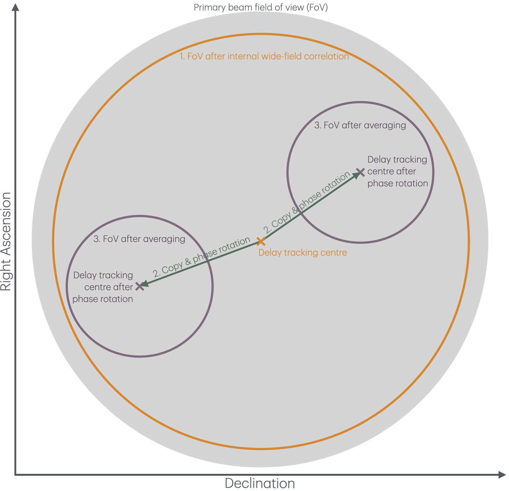
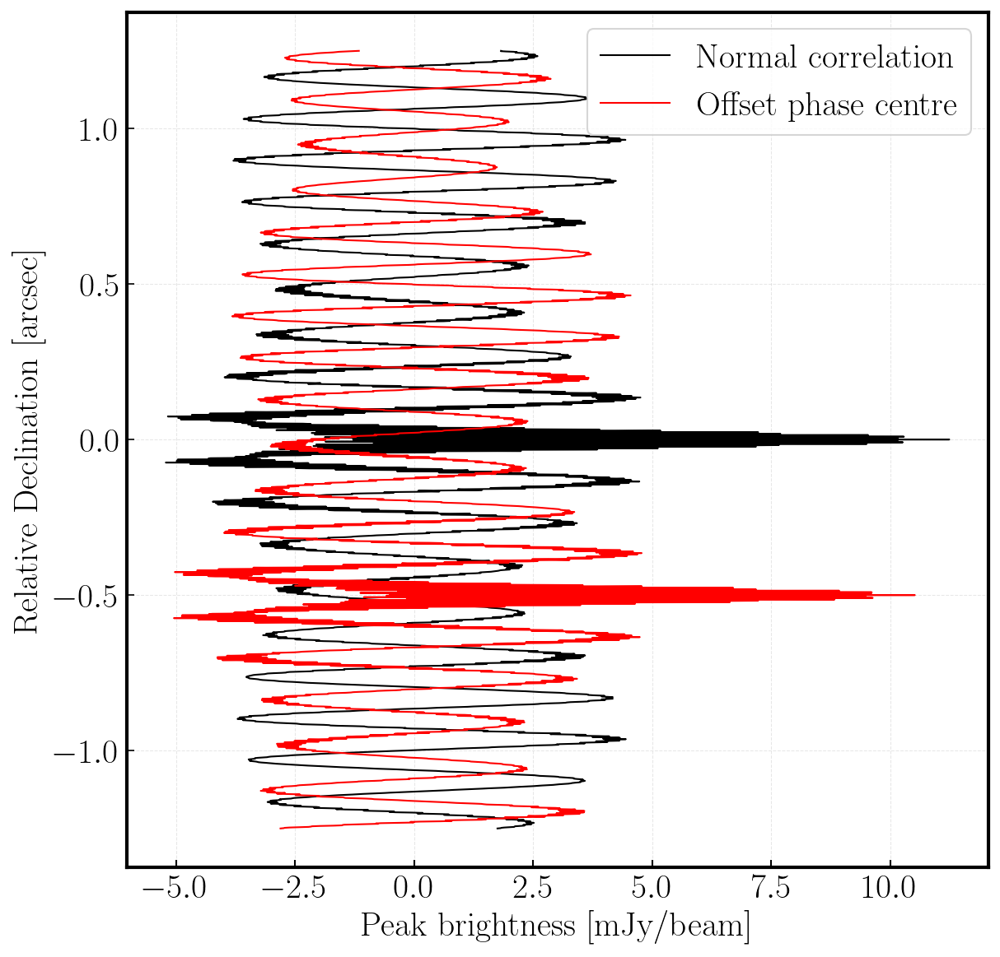

<!-- MathJax -->
<script src="https://cdnjs.cloudflare.com/ajax/libs/mathjax/2.7.7/MathJax.js?config=TeX-AMS-MML_HTMLorMML" type="text/javascript"></script> 
<script type="text/x-mathjax-config">
    MathJax.Hub.Config({
      tex2jax: {
        skipTags: ['script', 'noscript', 'style', 'textarea', 'pre'],
        inlineMath: [['$','$']],
        displayMath: [['$$','$$']]
      }
    });
</script>

<link href="styles.css" rel="stylesheet" />

<script type="text/javascript">
var pcs = document.lastModified.split(" ")[0].split("/");
var date = pcs[1] + '/' + pcs[0] + '/' + pcs[2];
onload = function(){
    document.getElementById("lastModified").innerHTML = "Page last modified on " + date;
}
		</script>

<!-- Prism CSS -->
<link rel="stylesheet" href="https://cdnjs.cloudflare.com/ajax/libs/prism/1.29.0/themes/prism.min.css" />
<link rel="stylesheet" href="https://cdnjs.cloudflare.com/ajax/libs/prism/1.29.0/plugins/line-numbers/prism-line-numbers.min.css" />

<!-- Prism JS -->
<script src="https://cdnjs.cloudflare.com/ajax/libs/prism/1.29.0/prism.min.js"></script>
<script src="https://cdnjs.cloudflare.com/ajax/libs/prism/1.29.0/components/prism-python.min.js"></script>
<script src="https://cdnjs.cloudflare.com/ajax/libs/prism/1.29.0/plugins/line-numbers/prism-line-numbers.min.js"></script>

[Return to the homepage](index.md)
# SFXC workshop 2025 • Wide-field processing

This page outlines the wide-field correlation tutorial that was presented as part of the first **SFXC workshop**, held on **21–23 September 2025** at the Joint Institute for VLBI in Europe ([JIVE](https://jive.eu){:target="_blank"}). For more information and resources regarding the SFXC workshop, see the [workshop webpage](https://indico.astron.nl/event/410){:target="_blank"} or return to the [homepage](index.md).

This tutorial is an introduction to the method of wide-field VLBI and the associated correlation implementation in SFXC. By the conclusion of this tutorial, you should be able to:
- Understand the correlation methods usually used to enable VLBI imaging across large areas of the sky. 
- Understand the considerations required to perform a successful wide-field correlation, especially with respect to the time/bandwidth smearing.
- Know how to set up and run SFXC to produce multiple phase centres. 
- Know how to post-process the correlator outputs to produce user-ready visibilities. 

## On this page
<ol type="A">
  <li><a href="#introduction">Introduction</a></li>
  <li><a href="#data-download">Project preparation and data download</a></li>
  <li><a href="#correlator-preparation">Correlator preparation</a></li>
  <li><a href="#running-the-correlator">Running the correlator</a></li>
  <li><a href="#post-processing">Post processing</a></li>
  <li><a href="#current--future-developments">Current &amp; future developments</a></li>
  <li><a href="#confirming-the-outcome">Confirming the outcome</a></li>
  <li><a href="#resources">Resources</a></li>
</ol>

## A. Introduction
### A1. Smearing
Wide-field VLBI is a specialised observing mode which correlates multiple positions across the primary beam of the interferometer. Wide-field VLBI correlation faced a fundamental challenge: to image a large fraction of the primary beam, the correlator must use **ultra-fine temporal and frequency resolution** to avoid:

- **Time smearing** — caused by averaging visibilities over long time intervals.
- **Bandwidth smearing** — caused by averaging over wide frequency channels.

Smearing is proportional to the baseline length (as shown in Figure [A1](#fig-a1)), therefore doing this for the **entire primary beam** of a VLBI array produces **huge datasets** (often many 10s of terabytes) and demands extreme computational resources, which is increasingly impractical with modern VLBI arrays’ higher bit rates.


<a name="fig-a1">**Figure A1**</a> - *Example image illustrating the effects of smearing on the imaging of extragalactic sources. The background image is from the short baselines of MeerKAT which shows no smearing in the image. However, when looking at higher resolution (as with e-MERLIN) smearing affects the source which is far from the delay tracking centre.*

### A2. Multiple phase centre observing

Instead of correlating the whole beam at full resolution, **software correlators** implement the *multiple phase centre observing* mode ([Deller et al. 2011](#ref_deller11)). This process has three distinct steps which are as follows (and shown in the Figure [A2](#fig-a2)):

1. **Initial correlation at high resolution**  
   The correlator internally processes the data with a fine time and frequency resolution. This retains the large field-of-view as smearing is kept to a minimum.

2. **Make copies & phase rotate to different positions within the primary beam**
   The observer specifies multiple positions within the primary beam. These could be:  
   - **Sources of interest** (e.g., calibrator + targets).  
   - Or a **grid** to cover the field.
   We then phase rotate the delay tracking centre to these positions.

3. **Average the phase rotated data sets**:  
   - **Average** to a manageable smearing (e.g., 30–60″ field of view).
   - Produces **small (∼GB) datasets** per phase centre instead of a single massive file.  
   - Each dataset can be calibrated and imaged independently and in parallel.

> **Important** - if you wish to use SFXC to perform wide-field correlations of interferometric arrays with shorter baselines (e.g., e-MERLIN), it may be simpler to carry out a standard correlation with higher time and frequency resolution to prevent smearing from affecting sources near the edge of the primary beam.



<a name="fig-a2">**Figure A2**</a> - *Diagram illustrating the wide-field correlation process when using the multiple phase centre observing technique, including the field-of-views defined by smearing after internal wide-field correlation, along with the shift and averaging steps involved.*


## B. Project preparation and data download

To prepare for the practical part of this tutorial, we need to ensure that you have the software and utilities available to execute all parts of the tutorial.

### Utilities required
- `curl`
- `wget` 
- `jq`
- `sed`
These are normally obtainable through your package manager (e.g., `apt` on Ubuntu) or are installed together with the OS.

### Software required
- `sfxc`
- `j2ms2`
- `tConvert`
- `CASA`: download and install instructions can be found on the [CASA homepage](https://casa.nrao.edu)

### Folder structure

With the software installed, we now wish to set up the data, supporting scripts and configuration files. We *recommend* making a new folder (called for example `n24l2_mpcc`) for this tutorial so that we do not inadvertently affect other tutorials. 

 A recommended file structure and an accompanying set of command line entries which can produce this file structure can be found below. Note that the final `wget` command will re-download the baseband data, so you could copy the baseband data across to the `raw_data` folder to save time. Note that, we will be only using the `No0005` scan so we only require a sub-set of the baseband data.

```text
└── n24l2_mpcc/
    ├── calibration/
    ├── N24L2_delays/
    ├── raw_data/
    │   ├── n24l2_cm_no0005.vdif
    │   ├── n24l2_de_no0005.vdif
    │   ├── n24l2_ef_no0005
    │   └── n24l2_hh_no0005
    ├── flag_weights.py
    ├── n24l2_calibration.py
    ├── n24l2.ctrl
    ├── n24l2.vix
    └── run_correlation_post_process.bash
```
```bash
mkdir -p n24l2_mpcc/calibration
cd n24l2_mpcc
wget https://www.jb.man.ac.uk/~radcliff/sfxc_workshop/n24l2.ctrl
wget https://www.jb.man.ac.uk/~radcliff/sfxc_workshop/run_correlation_post_process.bash
wget https://www.jb.man.ac.uk/~radcliff/sfxc_workshop/n24l2_calibration.py
wget -t45 -l1 -r -nd https://archive.jive.nl/sfxc-workshop/n24l2/ -A "n24l2*vix"
mkdir N24L2_delays
mkdir raw_data
cd raw_data
wget -t45 -l1 -r -nd https://archive.jive.nl/sfxc-workshop/n24l2/ -A "n24l2*no0005*"
cd ..
```

## C. Correlator preparation
### C1. Calculate wide-field correlation parameters

As was shown in Figure [A2](#fig-a2), a key step in wide-field correlation is:

1. Deciding what constitutes the acceptable smearing-constrained field-of-view for the internal wide-field correlation step — which determines how far you can extend from the original delay tracking centre (often the primary beam maximum). This is controlled by the `fft_size_correlation` and `sub_integr_time` parameters in the SFXC control file for bandwidth and time smearing, respectively.
2. Deciding what is the acceptable smearing-constrained field of view for the phase-rotated data sets involves determining how far you can go from the phase-rotated data set before smearing starts to affect the images. This is governed by the `number_channels` and `integr_time` parameters in the SFXC control file for bandwidth and time smearing, respectively.

We therefore need to determine the values of the **four** parameters which control the smearing. Some key considerations before we determine these values.

1. Are the positions selected to be targeted clustered within a single area (e.g., close to the primary beam maximum)? If so, consider reducing the FoV for the initial wide-field correlation to decrease the computational overhead. You might also want to move the delay tracking centre if they are systematically clustered in a specific direction.
2. Do the positions selected have large uncertainties associated with them? If so you may want to reduce the averaging of the phase shifted data-sets so that you can search a larger area around the positions.
3. Consider the output file sizes which can get very large very quickly. An estimate for the output file size is given by  $\simeq \frac{N_\mathrm{pc}\cdot N_\mathrm{hr}\cdot N_{\mathrm{sta}}\left(N_{\mathrm{sta}}+1\right)\cdot N_{\mathrm{SB}}\cdot N_\nu\cdot N_{\mathrm{pol}} \cdot f}{74565.4 \cdot t_{\mathrm{int}}} \text { GB. }$, where $N_\mathrm{pc}$ = number of phase centres, $N_\mathrm{hr}$ = number of hours observing, $N_{\mathrm{sta}}$ = number of stations participating, $N_{\mathrm{SB}}$ = number of subbands, $N_\nu$ = number of channels per subband, $N_{\mathrm{pol}}$ = number of output polarisation products, $t_\mathrm{int}$ = integration time and $f$ is a scaling factor that empirically has been seen to be  $\sim 1.4$ for $N_\nu \geq 1024$ and 1 otherwise. This size includes both the baselines and auto-correlations [Campbell et al. (2019)](#ref_campbell19).

#### Calculate the smearing values

Given these considerations, you should have an idea of what field-of-view you want for your observation and individual phase centres. We can now determine the frequency and time resolutions that correspond to these fields-of-views. The formulae described by [Wrobel et al., (1995)](#ref_wrobel95) for the max FoV corresponding to 10\% smearing are:

Bandwidth smearing: $\text{FoV} \lesssim 49.^{\prime \prime}5 \frac{1}{B} \frac{N_\nu}{\mathrm{BW_{SB}}}$ or $\lesssim 49 .^{\prime \prime} 5 \frac{1}{B} \frac{N_{\mathrm{SB}} N_\nu}{\mathrm{BW_{tot}}}$

Time smearing: $\text{FoV} \lesssim 18.^{\prime \prime}56 \frac{\lambda}{B} \frac{1}{t_{\mathrm{int}}}$

where $\mathrm{BW_{SB}}$ = bandwidth per subband (MHz), $\mathrm{BW_{tot}}$ = total bandwidth (MHz), $N_\mathrm{SB}$ = Number of subbands,  $N_\nu$ = number of frequency channels per subband (FFT size), $\text{FoV}$ = field-of-view (arcseconds) at a given baseline, $B$ = baseline length (km), $\lambda$ = wavelength (cm) and $t_\mathrm{int}$ = integration time (seconds).

To help you calculate these values, there is a widget below which calculates the smearing FoV values for different channelisation, observing frequencies and integration times together with a table containing values corresponding to short (Western European) baselines and global VLBI. These values are from [Campbell et al. (2019)](#ref_campbell19).

<!-- Interactive smearing FoV Calculator -->
<div class="card" id="fov-calc" style="padding:1rem; margin-top:1rem;">
  <h3 class="tight">Interactive smearing FoV calculator</h3>
  <p class="soft">Computes upper-limit FoVs (arcsec &amp; arcmin) due to (10%) bandwidth and time smearing.</p>
  <style>
    .fov-form { display:grid; grid-template-columns: 1fr 1fr; gap: 1rem; }
    .fov-field { display:flex; flex-direction:column; gap:.35rem; }
    .fov-field label { color: var(--muted); font-size:.95rem; }
    .fov-pill { display:inline-block; padding:.1rem .5rem; border:1px solid var(--border); border-radius:999px; font-size:.8rem; color:var(--muted); }
    #fov-calc input[type="number"]{
      width:100%; padding:.66rem .8rem; border-radius: calc(var(--radius, 12px) - 6px);
      border:1px solid var(--border); background: var(--bg-soft); color: var(--text);
      outline:none; appearance:textfield;
    }
    #fov-calc input[type="number"]:focus{
      border-color: color-mix(in oklab, var(--accent, #7da3ff) 50%, var(--border));
      box-shadow: 0 0 0 3px color-mix(in oklab, var(--accent, #7da3ff) 15%, transparent);
    }
    .fov-hint { color: var(--muted); font-size:.9rem; }
    .fov-sep { height:1px; background: var(--border); margin:.6rem 0; grid-column:1/-1; }
    .fov-row { display:flex; align-items:baseline; gap:.35rem; flex-wrap:wrap; }
    .fov-value { font-variant-numeric: tabular-nums; font-weight:800; font-size:1.6rem; }
    .fov-value-sm { font-variant-numeric: tabular-nums; font-weight:700; font-size:1.1rem; }
    .fov-unit { color: var(--muted); }
    .fov-btn {
      appearance:none; border:1px solid var(--border); background: color-mix(in oklab, var(--bg-soft) 85%, transparent);
      color: var(--text); padding:.55rem .9rem; border-radius: 10px; cursor:pointer;
    }
    .fov-btn:hover { border-color: color-mix(in oklab, var(--accent, #7da3ff) 50%, var(--border)); }
    .fov-small { font-size:.9rem; }
  </style>
  <form id="fov-form" class="fov-form" autocomplete="off">
    <div class="fov-field">
      <label for="B_km">Projected max baseline length B <span class="fov-pill">km</span></label>
      <input type="number" id="B_km" step="500" min="0" value="2500" />
    </div>
    <div class="fov-field">
      <label for="lambda_m">Wavelength λ <span class="fov-pill">m</span></label>
      <input type="number" id="lambda_m" step="0.01" min="0" value="0.18" />
    </div>
    <div class="fov-sep"></div>
    <div class="fov-field">
      <label for="Nnu">Number of channels per sub-band N<sub>ν</sub> <span class="fov-pill">#</span></label>
      <input type="number" id="Nnu" step="512" min="0" value="2048" />
    </div>
    <div class="fov-field">
      <label for="BW_SB">Sub-bandwidth BW<sub>SB</sub> <span class="fov-pill">MHz</span></label>
      <input type="number" id="BW_SB" step="8" min="0" value="32" />
    </div>
    <div class="fov-field">
      <label for="NSB">Number of sub-bands N<sub>SB</sub> <span class="fov-pill">#</span></label>
      <input type="number" id="NSB" step="1" min="1" value="1" />
    </div>
    <div class="fov-field">
      <label for="BW_tot">Total bandwidth BW<sub>tot</sub> <span class="fov-pill">MHz</span></label>
      <input type="number" id="BW_tot" step="8" min="0" value="32" />
      <div class="fov-hint">If BW<sub>tot</sub> = N<sub>SB</sub> · BW<sub>SB</sub>, both bandwidth forms match.</div>
    </div>
    <div class="fov-sep"></div>
    <div class="fov-field">
      <label for="tint">Integration time t<sub>int</sub> <span class="fov-pill">s</span></label>
      <input type="number" id="tint" step="0.5" min="0" value="1.0" />
    </div>
    <div class="fov-field" style="align-self:end">
      <span class="fov-hint">B=2500 km, Nν=2048, BW<sub>SB</sub>=32 MHz, t<sub>int</sub>=1 s, λ=0.18 m</span>
      <button type="button" id="resetFov" class="fov-btn">Reset to example</button>
    </div>
  </form>
  <div class="fov-sep"></div>
  <div class="steps" style="--step-prefix:'';">
    <div class="step">
      <h4 class="tight">Bandwidth smearing</h4>
      <div class="fov-row"><span class="fov-value" id="fovBW1">—</span><span class="fov-unit">arcsec</span></div>
      <div class="fov-row"><span class="fov-value" id="fovBW1min">—</span><span class="fov-unit">arcmin</span></div>
      <p class="soft fov-small">49.5″ · (1000/B<sub>km</sub>) · (N<sub>ν</sub>/BW<sub>SB</sub>)</p>
    </div>
    <div class="step">
      <h4 class="tight">Time smearing</h4>
      <div class="fov-row"><span class="fov-value" id="fovTime">—</span><span class="fov-unit">arcsec</span></div>
      <div class="fov-row"><span class="fov-value" id="fovTimeMin">—</span><span class="fov-unit">arcmin</span></div>
      <p class="soft fov-small">18.56″ · (λ/B) · (1/t<sub>int</sub>) → implemented as 18.56″ · (λ<sub>cm</sub> / (B<sub>km</sub>/1000)) · (1/t), i.e. 18.56″ · (100000·λ<sub>m</sub> / B<sub>km</sub>) · (1/t)</p>
    </div>
  </div>
</div>
<script>
(function(){
  const $ = id => document.getElementById(id);
  const fields = ["B_km","lambda_m","Nnu","BW_SB","NSB","BW_tot","tint"].map($);
  function fmt(x){
    if (!isFinite(x)) return "—";
    if (x === 0) return "0.00";
    const abs = Math.abs(x);
    return (abs >= 0.01 && abs < 1e5) ? x.toFixed(2) : x.toExponential(2);
  }
  function calc(){
    const B_km   = parseFloat($("B_km").value);
    const lambda = parseFloat($("lambda_m").value);
    const Nnu    = parseFloat($("Nnu").value);
    const BW_SB  = parseFloat($("BW_SB").value);
    const NSB    = parseFloat($("NSB").value);
    const BWtot  = parseFloat($("BW_tot").value);
    const tint   = parseFloat($("tint").value);
    const valid = [B_km,lambda,Nnu,BW_SB,NSB,BWtot,tint].every(v => isFinite(v) && v > 0);
    if(!valid){
      ["fovBW1","fovBW1min","fovTime","fovTimeMin","tableCheck","tableTimeCheck"].forEach(id => {
        const el = $(id);
        if (el) el.textContent = "—";
      });
      return;
    }
    // Bandwidth smearing (B in units of 1000 km)
    const factorB = 49.5 * (1000.0 / B_km);
    const fovBW1_sec = factorB * (Nnu / BW_SB);
    const fovBW1_min = fovBW1_sec / 60.0;
    // Time smearing (λ in m -> cm; B in 1000 km units)
    const fovTime_sec = 18.56 * ((lambda * 100000.0) / B_km) * (1.0 / tint);
    const fovTime_min = fovTime_sec / 60.0;
    $("fovBW1").textContent = fmt(fovBW1_sec);
    $("fovBW1min").textContent = fmt(fovBW1_min);
    $("fovTime").textContent = fmt(fovTime_sec);
    $("fovTimeMin").textContent = fmt(fovTime_min);
    // Optional checks (guarded so missing elements won't error)
    const bwCheckEl = $("tableCheck");
    if (bwCheckEl) bwCheckEl.textContent = fmt(49.5 * (1000.0 / 2500.0) * (2048 / 32.0));
    const timeCheckEl = $("tableTimeCheck");
    if (timeCheckEl) timeCheckEl.textContent = fmt(18.56 * ((0.18 * 100000.0) / 2500.0) * (1.0 / 1.0));
  }
  $("resetFov").addEventListener("click", () => {
    $("B_km").value = 2500;
    $("lambda_m").value = 0.18;
    $("Nnu").value = 2048;
    $("BW_SB").value = 32;
    $("NSB").value = 1;
    $("BW_tot").value = 32;
    $("tint").value = 1.0;
    calc();
  });
  fields.forEach(el => el.addEventListener("input", calc));
  calc();
})();
</script>
<div style="display: flex; gap: 2rem; align-items: flex-start; flex-wrap: wrap;">
  <div style="flex: 1; min-width: 300px;">
    <strong>Bandwidth smearing</strong>
    <table>
      <thead>
        <tr>
          <th>BW<sub>SB</sub><br/>(MHz)</th>
          <th>N<sub>ν</sub></th>
          <th>FoV<br/>(B=2,500 km)<br/>(arcsec)</th>
          <th>FoV<br/>(B=10,000 km)<br/>(arcsec)</th>
        </tr>
      </thead>
      <tbody>
        <tr><td>32</td><td>2048</td><td>1267.20</td><td>316.80</td></tr>
        <tr><td>32</td><td>512</td><td>316.80</td><td>79.20</td></tr>
        <tr><td>32</td><td>32</td><td>19.80</td><td>4.95</td></tr>
        <tr><td>16</td><td>2048</td><td>2534.40</td><td>633.60</td></tr>
        <tr><td>16</td><td>512</td><td>633.60</td><td>158.40</td></tr>
        <tr><td>16</td><td>32</td><td>39.60</td><td>9.90</td></tr>
        <tr><td>2</td><td>2048</td><td>20275.20</td><td>5068.80</td></tr>
        <tr><td>2</td><td>512</td><td>5068.80</td><td>1267.20</td></tr>
        <tr><td>2</td><td>32</td><td>316.80</td><td>79.20</td></tr>
      </tbody>
    </table>
  </div>
  <div style="flex: 1; min-width: 300px;">
    <strong>Time smearing</strong>
    <table>
      <thead>
        <tr>
          <th>λ<br/>(cm)</th>
          <th>t<sub>int</sub><br/>(s)</th>
          <th>FoV<br/>(B=2,500 km)<br/>(arcsec)</th>
          <th>FoV<br/>(B=10,000 km)<br/>(arcsec)</th>
        </tr>
      </thead>
      <tbody>
        <tr><td>18.0</td><td>1.00</td><td>133.20</td><td>33.30</td></tr>
        <tr><td>18.0</td><td>0.25</td><td>532.80</td><td>133.20</td></tr>
        <tr><td>6.0</td><td>1.00</td><td>44.40</td><td>11.10</td></tr>
        <tr><td>6.0</td><td>0.25</td><td>177.60</td><td>44.40</td></tr>
        <tr><td>1.3</td><td>1.00</td><td>9.62</td><td>2.40</td></tr>
        <tr><td>1.3</td><td>0.25</td><td>38.48</td><td>9.62</td></tr>
      </tbody>
    </table>
  </div>
</div>


### C2. Edit the control (ctrl) file

Now that you have some approximate numbers for the time and bandwidth averaging needed for both steps of the correlation, we can edit the control file to set the four parameters that control the smearing. 

If you inspect the `n24l2.ctrl` file, you can see that is set up already for standard correlation apart from the paths to the data and output files. Edit the file to replace `<path_to_tutorial>` parts with your real path. There is a command line entry below that you can use too. 

>***Cheat script:***
```bash 
sed -i.bak 's|<path_to_tutorial>|/your/path/to/n24l2_mpcc|g' n24l2.ctrl
```
>Replace `/your/path/to/` with the real path to the `n24l2_mpcc` folder. 

Next, we can convert the control file to do multiple phase centre correlation. We first specify this by entering:
```json
multi_phase_center: true
```
Then we use internal wide-field correlation is governed by:
- `fft_size_correlation` — number of frequency points/channels per subband ($N_\mathrm{FFT}$). This must be a power of 2.
- `sub_integr_time` — sub integration time $t_{\mathrm{int,sub}}$ in microseconds. Note that this needs to respect $t_\mathrm{int,sub} = \frac{N}{2\Delta\nu_\mathrm{SB}}\cdot N_\mathrm{FFT}$

And the averaging of the phase shifted data by:
- `number_channels` - number of frequency points/channels per subband.
- `integr_time` - integration time. This needs to satisfy the following: $t_{\mathrm{int}} \geq N_\nu / \mathrm{BW}_{\mathrm{SB}}$

Finally we need to ensure that multi-phase centre correlation is enabled:

>***Cheat script:***
>```bash 
>jq '.multi_phase_center = (.multi_phase_center // true) | .sub_integr_time = (.sub_integr_time // 13056) | .fft_size_correlation = (.>fft_size_correlation // 16384)' n24l2.ctrl > n24l2.ctrl.tmp && mv n24l2.ctrl.tmp n24l2.ctrl
>```

### C3. Edit the vix file

With the control file now ready, we need to edit the vix file. First, search for the `$SOURCE` section of the VIX file and add in the locations of the new positions to be correlated on. This must be in the format that is specified below:

```text
def J0854_off;
  source_name = J0854_off;
  ra = 08h54m48.8749270s;
  dec = 20d06'31.140851";
  ref_coord_frame = J2000;
enddef;
```

Next we need to include the the new source names in all relevant scans in the `$SCHED` section as shown below:
```text
scan No0005;
   start = 2024y144d12h47m00s;
   mode = sess224.L1024;
   station = Cm : 0 sec : 600 sec : 0.000000000 GB :   : &n : 1;
   station = Da : 0 sec : 600 sec : 0.000000000 GB :   : &n : 1;
   station = De : 0 sec : 600 sec : 0.000000000 GB :   : &n : 1;
   station = Ef : 0 sec : 600 sec : 0.000000000 GB :   : &ccw : 1;
   station = Hh : 0 sec : 600 sec : 0.000000000 GB :   :   : 1;
   station = Ir : 0 sec : 600 sec : 0.000000000 GB :   : &ccw : 1;
   station = Jb : 0 sec : 600 sec : 0.000000000 GB :   : &n : 1;
   station = Kn : 0 sec : 600 sec : 0.000000000 GB :   : &n : 1;
   station = Mc : 0 sec : 600 sec : 0.000000000 GB :   : &n : 1;
   station = Nt : 0 sec : 600 sec : 0.000000000 GB :   : &n : 1;
   station = O8 : 0 sec : 600 sec : 0.000000000 GB :   :   : 1;
   station = Pi : 0 sec : 600 sec : 0.000000000 GB :   : &n : 1;
   station = Tr : 0 sec : 600 sec : 0.000000000 GB :   : &n : 1;
   station = Wb : 0 sec : 600 sec : 0.000000000 GB :   :   : 1;
source = J0854+2006; source = J0854_off;
```

>***Cheat script:*** 
>```bash
>ed -s n24l2.vix &lt;&lt; 'ED'
>407a
>def J0854_off;
>source_name = J0854_off;
>ra = 08h54m48.8749270s;
>dec = 20d06'31.140851";
>ref_coord_frame = J2000;
>enddef;
>.
>wq
>ED
>
>sed -i.bak -E 's/^[[:space:]]*source[[:space:]]*=[[:space:]]*J0854\+2006;[[:space:]]*$/source = J0854+2006; source = J0854_off;/' >24l2.vix
>```

Note that there is no limit to the number of sources that you can specify here, and it is just a matter of defining the coordinates in the `$SOURCE` section and then adding the source name in the relevant scans (`$SCHED` section).  

## D. Running the correlator

Once this is complete, we can just run `sfxc`, as shown in the previous tutorials:

```bash
mpirun sfxc n24l2.ctrl n24l2.vix
```

This will produce two output files instead of one -- corresponding to each of the phase centres. The files are appended with the source name so you should have `N24L2.cor_J0854+2006` and `N24L2.cor_J0854_OFF` in your current working directory.

## E. Post processing

Now that these two output correlations are completed, we can continue with the standard post-processing steps. The only difference with standard correlation is that you do the steps with each `.cor` file separately. This is highly parallelisable!

**Convert to Measurement Set with `j2ms2`:**

Firstly, we convert into a measurement set, remembering that we need to define the setup reference station due to the mixed bandwidths correlation that was performed.

```bash
j2ms2 -o n24l2_1_1.ms eo:setup_ref_station=Ef N24L2.cor_J0854+2006
j2ms2 -o n24l2_2_1.ms eo:setup_ref_station=Ef N24L2.cor_J0854_off
```

Note that the normal practice is that the first measurement set will also contain the correlated scans of the calibrator sources as well. This is because the calibration that will be performed on the calibrators will be identically applicable to all of the phase centres. 

**Flag low weights**

We then flag the low weights in these data. Note that this is using a modified `flag_weights.py` that uses CASA. 

```bash
casa --nologger --log2term -c flag_weights.py n24l2_1_1.ms 0.7 True
casa --nologger --log2term -c flag_weights.py n24l2_2_1.ms 0.7 True
```

**Convert MS to FITS-IDI with `tConvert`:**

Finally, we convert each of the measurement sets into a FITS IDI file (one per each phase centre).  

```bash
tConvert n24l2_1_1.ms n24l2_1_1.IDI
tConvert n24l2_2_1.ms n24l2_2_1.IDI
```

If IDI files exceed 2 GB, they may be split into ~1.9 GB chunks (as on the EVN archive).

## F. Confirming the outcome

Finally, with the data correlated and post-processed, we can now calibrate these data to illustrate the phase shifting technique employed. To do this, copy your IDI files into the calibration folder and then change directory into that folder. This is just to ensure that we start the calibration process with a clean slate. With multiple phase centre observing, the data-sets are corrupted by the majority of the same calibration effects, therefore you only need to calibrate a single phase centre to calibrate them all. Only direction-dependent effects such as primary beam corrections require different corrections per phase centre.

In this tutorial, we are just going to fringefit these data to reveal the source location and are omitting other calibration steps such as flux scaling, amplitude corrections etc. If you wish to learn how to reduce the data, please refer to the JIVE VLBI school 2025.

Firstly, we will convert the two IDI files into a CASA-compatible measurement set,

```python
importfitsidi(fitsidifile='n24l2_1_1.IDI',
              vis='n24l2_A.ms')
importfitsidi(fitsidifile='n24l2_2_1.IDI',
              vis='n24l2_B.ms')
```

We will then fringe-fit the phase centre with the source located at the delay tracking centre,

```python
fringefit(vis='n24l2_A.ms',
          caltable='n24l2.sbd',
          refant='EF',
          corrdepflags=True)
```

With the solutions obtained, we can now apply these solutions to the measurement sets to align the phases and the visibilities should now constructively interfere where the source is located. 
```python
applycal(vis='n24l2_A.ms',
         gaintable=['n24l2.sbd'],
         parang=True)
applycal(vis='n24l2_B.ms',
         gaintable=['n24l2.sbd'],
         parang=True)
```

To visualise this, we can generate an image of both phase centres.

```python
tclean(vis='n24l2_A.ms',
       field='J0854+2006',
       imagename='J0854+2006_IM_dirty',
       imsize=2500,
       cell='1mas',
       niter=0)
tclean(vis='n24l2_B.ms',
       field='J0854_OFF',
       imagename='J0854_OFF_IM_dirty',
       imsize=2500,
       cell='1mas',
       niter=0)
```
These images will be extremely ugly as we are only using a few seconds of data. However, if you visualise this with the CASA `viewer` or CARTA, you should see that there is an amplitude spike at the source position, which is offset from the delay tracking centre by 0.5 arcseconds (as expected!). We visualise this in Figure F1, which shows a Declination slice at a fixed Right Ascension showing the fringe spikes at the expected source location with one phase centre being offset. In Figure F2, we clean this data-set to illustrate the location of the source. Note that we have fixed the restoring beam. 



**Figure F1** - A central Right Ascension slice of the two (uncleaned) images of the two phase centres showing the increase in fringe amplitude height at the expected location of the source.


**Figure F2** - Cleaned images of both phase centres. The restoring beam is circular for visualisation purposed with the peak pixel identified by the red arrow.

>***Cheat script:***

## G. Current & future developments
- Containerised software

```bash
singularity exec --env CALC_DIR=/home/azimuth/n24l2/sfxc/sfxc/lib/calc10/data --bind /home:/home sfxc_ipp.simg mpirun sfxc n24l2_mpcc.ctrl n24l2_mpcc.vix
```

```bash
singularity run --app j2ms2 jive-casa.simg -o n24l2_1_1.ms N24L2.cor_J0854+2006
singularity run --app j2ms2 jive-casa.simg -o n24l2_2_1.ms N24L2.cor_J0854_off
```

```bash
casa --nologger --log2term -c flag_weights.py n24l2_1_1.ms 0.7 True
casa --nologger --log2term -c flag_weights.py n24l2_2_1.ms 0.7 True
```

```bash
singularity run --app tConvert jive-casa.simg n24l2_1_1.ms n24l2_1_1.IDI
singularity run --app tConvert jive-casa.simg n24l2_2_1.ms n24l2_2_1.IDI
```


Conversion generally uses helper software from the **jive-casa** repository: <https://code.jive.eu/verkout/jive-casa>.

- Automated wide-field correlation software
- Smearing corrections
- End-to-end correlation & calibration


## H. Resources
### Technical papers/memos on wide-field correlation
<a name="ref_deller11">1.</a> Deller, A. T., et al., “DiFX-2: A More Flexible, Efficient, Robust, and Powerful Software Correlator”, *PASP*, 123(901), 275 (2011). DOI: [10.1086/658907](https://ui.adsabs.harvard.edu/abs/2011PASP..123..275D/abstract){:target="_blank"}  
<a name="ref_morgan11">2.</a> Morgan, J. S., et al., “VLBI imaging throughout the primary beam using accurate UV shifting”, *A&A*, 526, A140 (2011). DOI: [10.1051/0004-6361/201015138](https://ui.adsabs.harvard.edu/abs/2011A%26A...526A.140M/abstract){:target="_blank"}  
<a name="ref_keimpema15">3.</a> Keimpema, A., et al., “The SFXC software correlator for very long baseline interferometry: algorithms and implementation”, *Experimental Astronomy*, 39(2), 259–279 (2015). DOI: [10.1007/s10686-015-9462-z](https://ui.adsabs.harvard.edu/abs/2015ExA....39..259K/abstract){:target="_blank"}
<a name="ref_campbell19">4.</a> Campbell, B., “Field of View Calculations for SFXC”, EVN JIVE documentation, revised 3 January 2019. Retrieved from the [EVN website](https://www.evlbi.org/sites/default/files/users/Gina/fovSFXC.pdf){:target="_blank"}. DOI: not available.  
<a name="ref_wrobel95">5.</a> Wrobel, J. M., “VLBI Observing Strategies”, *Very Long Baseline Interferometry and the VLBA*, ASP Conf. Ser., 82, 411 (1995). DOI: [1995ASPC...82..411W](https://ui.adsabs.harvard.edu/abs/1995ASPC...82..411W/abstract){:target="_blank"}

### Technical papers/memos on wide-field correlation

---
_Content built by Jack Radcliffe._ <i><span id="lastModified"></span></i>

_Built with ♥ — Markdown + HTML + CSS + Prism.js + a bit of AI + Jack Radcliffe (2025)_

<!-- Custom Script: funcs.js -->
<script>
    const copy = (el) => {
      const pre = document.querySelector(el);
      if (!pre) return;
      const code = pre.innerText;
      navigator.clipboard.writeText(code).then(() => {
        const btn = document.querySelector(`[data-copy="${el}"]`);
        if (!btn) return;
        const old = btn.textContent;
        btn.textContent = 'Copied!';
        setTimeout(() => (btn.textContent = old), 1500);
      });
    };
    document.addEventListener('click', (e) => {
      const t = e.target;
      if (t.matches('.copy-btn')) {
        const target = t.getAttribute('data-copy');
        copy(target);
      }
    });
</script>