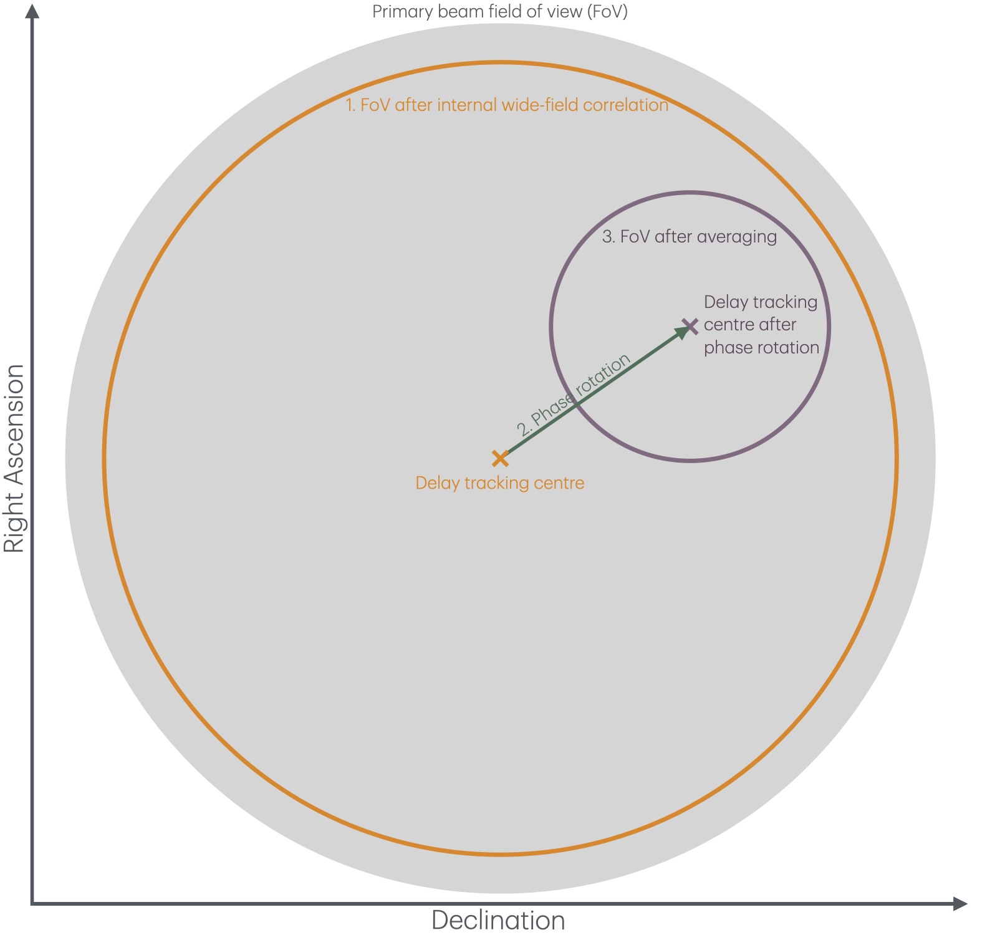

<!-- MathJax -->
<script src="https://cdnjs.cloudflare.com/ajax/libs/mathjax/2.7.7/MathJax.js?config=TeX-AMS-MML_HTMLorMML" type="text/javascript"></script> 
<script type="text/x-mathjax-config">
    MathJax.Hub.Config({
      tex2jax: {
        skipTags: ['script', 'noscript', 'style', 'textarea', 'pre'],
        inlineMath: [['$','$']],
        displayMath: [['$$','$$']]
      }
    });
</script>

<link href="styles.css" rel="stylesheet" />

<!-- Prism CSS -->
<link rel="stylesheet" href="https://cdnjs.cloudflare.com/ajax/libs/prism/1.29.0/themes/prism.min.css" />
<link rel="stylesheet" href="https://cdnjs.cloudflare.com/ajax/libs/prism/1.29.0/plugins/line-numbers/prism-line-numbers.min.css" />

<!-- Prism JS -->
<script src="https://cdnjs.cloudflare.com/ajax/libs/prism/1.29.0/prism.min.js"></script>
<script src="https://cdnjs.cloudflare.com/ajax/libs/prism/1.29.0/components/prism-python.min.js"></script>
<script src="https://cdnjs.cloudflare.com/ajax/libs/prism/1.29.0/plugins/line-numbers/prism-line-numbers.min.js"></script>

[Return to the homepage](index.md)
# SFXC workshop 2025 • Wide-field processing

This page outlines the wide-field correlation tutorial that was presented as part of the first **SFXC workshop**, held on **21–23 September 2025** at the Joint Institute for VLBI in Europe ([JIVE](https://jive.eu){:target="_blank"}). For more information and resources regarding the workshop, see the [workshop webpage](https://indico.astron.nl/event/410) or return to the [homepage](index.md).

## On this page
1. [Introduction](#introduction)
2. [Data download](#data-download)
3. [Project setup](#project-setup)
4. [Correlator preparation](#correlator-preparation)
5. [Running the correlator](#running-the-correlator)
6. [Post processing](#post-processing)
7. [Current & future developments](#current--future-developments)
8. [Resources](#resources)

## Introduction
Wide-field VLBI is a specialised observing mode which correlates multiple sources within a single observation which are scattered across the primary beam of the interferometer. Wide-field VLBI correlation faced a fundamental challenge: to image a large fraction of the primary beam, the correlator must use **ultra-fine temporal and frequency resolution** to avoid:

- **Time smearing** — caused by averaging visibilities over long time intervals.
- **Bandwidth smearing** — caused by averaging over wide frequency channels.

Doing this for the **entire primary beam** produces **huge datasets** (often terabytes) and demands extreme computational resources, which is increasingly impractical with modern VLBI arrays’ higher bit rates.

Instead of correlating the whole beam at full resolution, **software correlators** implement the *multiple phase centre observing* mode (Deller et al. 2011). This process has three distinct steps which are as follows (and shown in the Figure below):

1. **Initial correlation at high resolution**  
   The correlator internally processes the data with a fine time and frequency resolution. This retains the large field-of-view as smearing is kept to a minimum.

2. **Make copies & phase rotate to different positions within the primary beam**
   The observer specifies multiple positions within the primary beam. These could be:  
   - **Sources of interest** (e.g., calibrator + targets).  
   - Or a **grid** to cover the field.
   We then phase rotate the delay tracking centre to these positions.

3. **Average the phase rotated data sets**:  
   - **Average** to a manageable smearing (e.g., 30–60″ field of view).
   - Produces **small (∼GB) datasets** per phase centre instead of a single massive file.  
   - Each dataset can be calibrated and imaged independently and in parallel.



---

## Data download
For this tutorial, you will need the following data and scripts: 
1. Raw baseband data and vix files from the original correlation tutorial. This can be found at the [N24L2 data download page](https://archive.jive.nl/sfxc-workshop/n24l2/){:target="_blank"}. This can also be downloaded using the command line:
```bash
wget -t45 -l1 -r -nd https://archive.jive.nl/sfxc-workshop/n24l2/ -A "n24l2*"
```
2. The standard SFXC control (.ctrl) file for this observation. This can be downloaded using the following link.

3. CASA calibration tables. 

## Project setup


## Correlator preparation
### A1. Calculate wide-field correlation parameters

As was shown in the Figure above, a key step in wide-field correlation is:

1. Deciding what is the acceptable smearing-constrained field-of-view is for internal wide-field correlation step -- which determines how far you can go from the original delay tracking centre (often the primary beam maximum)
2. Deciding what is the acceptable smearing-constrained field-of-view is for the phase-rotated 

$\simeq \frac{N_{\mathrm{sta}}\left(N_{\mathrm{sta}}+1\right) N_{\mathrm{SB}} N_\nu N_{\mathrm{pol}} \cdot f}{74565.4 \cdot t_{\mathrm{int}}} \text { GB per hour observing. }$

<!-- Interactive FoV Calculator -->
<div class="card" id="fov-calc" style="padding:1rem; margin-top:1rem;">
  <h3 class="tight">Interactive smearing FoV calculator</h3>
  <p class="soft">Computes upper-limit FoVs (arcsec &amp; arcmin) due to (10%) bandwidth and time smearing.</p>
  <style>
    .fov-form { display:grid; grid-template-columns: 1fr 1fr; gap: 1rem; }
    .fov-field { display:flex; flex-direction:column; gap:.35rem; }
    .fov-field label { color: var(--muted); font-size:.95rem; }
    .fov-pill { display:inline-block; padding:.1rem .5rem; border:1px solid var(--border); border-radius:999px; font-size:.8rem; color:var(--muted); }
    #fov-calc input[type="number"]{
      width:100%; padding:.66rem .8rem; border-radius: calc(var(--radius, 12px) - 6px);
      border:1px solid var(--border); background: var(--bg-soft); color: var(--text);
      outline:none; appearance:textfield;
    }
    #fov-calc input[type="number"]:focus{
      border-color: color-mix(in oklab, var(--accent, #7da3ff) 50%, var(--border));
      box-shadow: 0 0 0 3px color-mix(in oklab, var(--accent, #7da3ff) 15%, transparent);
    }
    .fov-hint { color: var(--muted); font-size:.9rem; }
    .fov-sep { height:1px; background: var(--border); margin:.6rem 0; grid-column:1/-1; }
    .fov-row { display:flex; align-items:baseline; gap:.35rem; flex-wrap:wrap; }
    .fov-value { font-variant-numeric: tabular-nums; font-weight:800; font-size:1.6rem; }
    .fov-value-sm { font-variant-numeric: tabular-nums; font-weight:700; font-size:1.1rem; }
    .fov-unit { color: var(--muted); }
    .fov-btn {
      appearance:none; border:1px solid var(--border); background: color-mix(in oklab, var(--bg-soft) 85%, transparent);
      color: var(--text); padding:.55rem .9rem; border-radius: 10px; cursor:pointer;
    }
    .fov-btn:hover { border-color: color-mix(in oklab, var(--accent, #7da3ff) 50%, var(--border)); }
    .fov-small { font-size:.9rem; }
  </style>
  <form id="fov-form" class="fov-form" autocomplete="off">
    <div class="fov-field">
      <label for="B_km">Baseline length B <span class="fov-pill">km</span></label>
      <input type="number" id="B_km" step="500" min="0" value="2500" />
      <div class="fov-hint">Projected baseline length.</div>
    </div>
    <div class="fov-field">
      <label for="lambda_m">Wavelength λ <span class="fov-pill">m</span></label>
      <input type="number" id="lambda_m" step="0.01" min="0" value="0.18" />
      <div class="fov-hint">Example: 0.18 m (≈ 1.6 GHz)</div>
    </div>
    <div class="fov-sep"></div>
    <div class="fov-field">
      <label for="Nnu">Number of channels per sub-band N<sub>ν</sub></label>
      <input type="number" id="Nnu" step="512" min="0" value="2048" />
    </div>
    <div class="fov-field">
      <label for="BW_SB">Sub-bandwidth BW<sub>SB</sub> <span class="fov-pill">MHz</span></label>
      <input type="number" id="BW_SB" step="8" min="0" value="32" />
    </div>
    <div class="fov-field">
      <label for="NSB">Number of sub-bands N<sub>SB</sub></label>
      <input type="number" id="NSB" step="1" min="1" value="1" />
    </div>
    <div class="fov-field">
      <label for="BW_tot">Total bandwidth BW<sub>tot</sub> <span class="fov-pill">MHz</span></label>
      <input type="number" id="BW_tot" step="8" min="0" value="32" />
      <div class="fov-hint">If BW<sub>tot</sub> = N<sub>SB</sub> · BW<sub>SB</sub>, both bandwidth forms match.</div>
    </div>
    <div class="fov-sep"></div>
    <div class="fov-field">
      <label for="tint">Integration time t<sub>int</sub> <span class="fov-pill">s</span></label>
      <input type="number" id="tint" step="0.5" min="0" value="1.0" />
    </div>
    <div class="fov-field" style="align-self:end">
      <button type="button" id="resetFov" class="fov-btn">Reset to example</button>
      <span class="fov-hint">B=2500 km, Nν=2048, BW<sub>SB</sub>=32 MHz, t<sub>int</sub>=1 s, λ=0.18 m</span>
    </div>
  </form>
  <div class="fov-sep"></div>
  <div class="steps" style="--step-prefix:'';">
    <div class="step">
      <h4 class="tight">Bandwidth smearing</h4>
      <div class="fov-row"><span class="fov-value" id="fovBW1">—</span><span class="fov-unit">arcsec</span></div>
      <div class="fov-row"><span class="fov-value-sm" id="fovBW1min">—</span><span class="fov-unit">arcmin</span></div>
      <p class="soft fov-small">49.5″ · (1000/B<sub>km</sub>) · (N<sub>ν</sub>/BW<sub>SB</sub>)</p>
    </div>
    <div class="step">
      <h4 class="tight">Time smearing</h4>
      <div class="fov-row"><span class="fov-value" id="fovTime">—</span><span class="fov-unit">arcsec</span></div>
      <div class="fov-row"><span class="fov-value-sm" id="fovTimeMin">—</span><span class="fov-unit">arcmin</span></div>
      <p class="soft fov-small">18.56″ · (λ/B) · (1/t<sub>int</sub>) → implemented as 18.56″ · (λ<sub>cm</sub> / (B<sub>km</sub>/1000)) · (1/t), i.e. 18.56″ · (100000·λ<sub>m</sub> / B<sub>km</sub>) · (1/t)</p>
    </div>
  </div>
</div>
<script>
(function(){
  const $ = id => document.getElementById(id);
  const fields = ["B_km","lambda_m","Nnu","BW_SB","NSB","BW_tot","tint"].map($);
  function fmt(x){
    if (!isFinite(x)) return "—";
    if (x === 0) return "0.00";
    const abs = Math.abs(x);
    return (abs >= 0.01 && abs < 1e5) ? x.toFixed(2) : x.toExponential(2);
  }
  function calc(){
    const B_km   = parseFloat($("B_km").value);
    const lambda = parseFloat($("lambda_m").value);
    const Nnu    = parseFloat($("Nnu").value);
    const BW_SB  = parseFloat($("BW_SB").value);
    const NSB    = parseFloat($("NSB").value);
    const BWtot  = parseFloat($("BW_tot").value);
    const tint   = parseFloat($("tint").value);
    const valid = [B_km,lambda,Nnu,BW_SB,NSB,BWtot,tint].every(v => isFinite(v) && v > 0);
    if(!valid){
      ["fovBW1","fovBW1min","fovTime","fovTimeMin","tableCheck","tableTimeCheck"].forEach(id => {
        const el = $(id);
        if (el) el.textContent = "—";
      });
      return;
    }
    // Bandwidth smearing (B in units of 1000 km)
    const factorB = 49.5 * (1000.0 / B_km);
    const fovBW1_sec = factorB * (Nnu / BW_SB);
    const fovBW1_min = fovBW1_sec / 60.0;
    // Time smearing (λ in m -> cm; B in 1000 km units)
    const fovTime_sec = 18.56 * ((lambda * 100000.0) / B_km) * (1.0 / tint);
    const fovTime_min = fovTime_sec / 60.0;
    $("fovBW1").textContent = fmt(fovBW1_sec);
    $("fovBW1min").textContent = fmt(fovBW1_min);
    $("fovTime").textContent = fmt(fovTime_sec);
    $("fovTimeMin").textContent = fmt(fovTime_min);
    // Optional checks (guarded so missing elements won't error)
    const bwCheckEl = $("tableCheck");
    if (bwCheckEl) bwCheckEl.textContent = fmt(49.5 * (1000.0 / 2500.0) * (2048 / 32.0));
    const timeCheckEl = $("tableTimeCheck");
    if (timeCheckEl) timeCheckEl.textContent = fmt(18.56 * ((0.18 * 100000.0) / 2500.0) * (1.0 / 1.0));
  }
  $("resetFov").addEventListener("click", () => {
    $("B_km").value = 2500;
    $("lambda_m").value = 0.18;
    $("Nnu").value = 2048;
    $("BW_SB").value = 32;
    $("NSB").value = 1;
    $("BW_tot").value = 32;
    $("tint").value = 1.0;
    calc();
  });
  fields.forEach(el => el.addEventListener("input", calc));
  calc();
})();
</script>


The multiple phase centre observing mode of the correlator requires four parameters to be set correctly:


"integr_time": 2.0, "number_channels": 64,
- `fft_size_correlation` — number of frequency points $N_\mathrm{FFT}$ (power of 2).
- `sub_integr_time` — sub integration time $t_{\mathrm{int,sub}}$ in microseconds.

Typical constraints include **time and bandwidth smearing** so that the farthest phase centre position is kept below an acceptable level (often **1%** at JIVE).

$t_{\mathrm{int}} \geq N_\nu / B W_{\mathrm{SB}}$

$t_{\mathrm{int}, \mathrm{sub}}=\frac{N}{2 \Delta v_{\mathrm{SB}}} \cdot N_{\mathrm{FFT}}$

Bandwidth : $FoV \lesssim 49.^{\prime \prime}5 \frac{1}{B} \frac{N_\nu}{B W_{\mathrm{SB}}}$ or $\lesssim 49 .^{\prime \prime} 5 \frac{1}{B} \frac{N_{\mathrm{SB}} N_\nu}{B W_{\mathrm{tot}}}$

Time : $FoV \lesssim 18.^{\prime \prime}56 \frac{\lambda}{B} \frac{1}{t_{\mathrm{int}}}$

$t_\mathrm{int,sub} = \frac{N}{2\Delta\nu_\mathrm{SB}}\cdot N_\mathrm{FFT}$


**Bandwidth smearing**

| $\mathrm{BW_{SB}}$<br/>(MHz) |       $N_\nu$        | FoV (B = 2,500 km)<br/>(arcsec) | FoV (B = 10,000 km)<br/>(arcsec) |
|--------------------|--------------------|--------------------|-----------------------|
| 32     | 2048         | 1267.20          | 316.80             |
| 32     | 512          | 316.80           | 79.20              |
| 32     | 32           | 19.80            | 4.95               |
| 16     | 2048         | 2534.40          | 633.60             |
| 16     | 512          | 633.60           | 158.40             |
| 16     | 32           | 39.60            | 9.90               |
| 2      | 2048         | 20275.20         | 5068.80            |
| 2      | 512          | 5068.80          | 1267.20            |
| 2      | 32           | 316.80           | 79.20              |

**Time smearing**

| $\lambda$<br/>(cm)|$t_\mathrm{int}$<br/>(s)|FoV (B = 2,500 km)<br/>(arcsec)|FoV (B = 10,000 km)<br/>(arcsec)|
|--------------------|--------------------|--------------------|-----------------------|
| 18.0       | 1.00  | 133.20           | 33.30              |
| 18.0       | 0.25  | 532.80           | 133.20             |
| 6.0        | 1.00  | 44.40            | 11.10              |
| 6.0        | 0.25  | 177.60           | 44.40              |
| 1.3        | 1.00  | 9.62             | 2.40               |
| 1.3        | 0.25  | 38.48            | 9.62               |

$\mathrm{BW_{SB}}$ = Bandwidth per subband (MHz), $N_\nu$ = Number of frequency channels per subband (FFT size), FoV = field-of-view (arcseconds) at a given baseline, B = baseline length (km), $\lambda$ = wavelength (cm), $t_\mathrm{int}$ = integration time (seconds)

### A2. Edit the control (ctrl) file
Ensure multi-phase centre correlation is enabled:

```text
multi_phase_center = true
```

### A3. Edit the VEX file
Define each phase centre in the `$SOURCE` section (example):
```text
def RFC1;
  source_name = RFC1;
  ra = 12h26m22.5068s;
  dec = 64d06'22.046";
  ref_coord_frame = J2000;
enddef;
```

Include the new source names in all relevant scans in `$SCHED` (example):
```text
scan No0005;
  start=2022y108d15h50m09s; mode=EFF_BAND_32; source=J1229+6335;source=RFC1;
  station=Ef:    0 sec:  132 sec:      0.000000000 GB:   : &cw   : 1;
  station=O8:    0 sec:  132 sec:      0.000000000 GB:   :       : 1;
  station=Tr:    0 sec:  132 sec:      0.000000000 GB:   : &ccw  : 1;
  station=Mc:    0 sec:  132 sec:      0.000000000 GB:   : &ccw  : 1;
  station=Nt:    0 sec:  132 sec:      0.000000000 GB:   : &ccw  : 1;
endscan;
```


## Running the correlator
### B1. Execute the correlator
_Add concrete run commands and environment details here._

## Post processing
The correlator produces a custom `.cor` format that you can convert to standard interferometric formats.

Conversion generally uses helper software from the **jive-casa** repository: <https://code.jive.eu/verkout/jive-casa>.
A Singularity image may be available at `/SOFTWARE/jive-casa/jive-casa.img`.

**Convert to Measurement Set with `j2ms2`:**
```bash
singularity run --app j2ms2 /SOFTWARE/jive-casa/jive-casa.img <correlator_outputs>.corr
```

This produces `<vix_prefix>.ms`. If multiple correlator outputs exist, pass them all as arguments to `j2ms2`.

**Convert MS to FITS-IDI with `tConvert`:**
```bash
singularity run --app tConvert /SOFTWARE/jive-casa/jive-casa.img <measurement_set.ms> <output_idi>.IDI
```

If IDI files exceed 2 GB, they may be split into ~1.9 GB chunks (as on the EVN archive).

## Current & future developments
- Containerised software
- Automated wide-field correlation software
- End-to-end correlation & calibration

## Resources
### Technical papers/memos on wide-field correlation
1. Deller, A. T., et al., “DiFX-2: A More Flexible, Efficient, Robust, and Powerful Software Correlator”, *PASP*, 123(901), 275 (2011). doi: <https://ui.adsabs.harvard.edu/abs/2011PASP..123..275D/abstract>
2. Morgan, J. S., et al., “VLBI imaging throughout the primary beam using accurate UV shifting”, *A&A*, 526, A140 (2011). doi: <https://ui.adsabs.harvard.edu/abs/2011A%26A...526A.140M/abstract>
3. Keimpema, A., et al., “The SFXC software correlator for very long baseline interferometry: algorithms and implementation”, *Experimental Astronomy*, 39(2), 259–279 (2015). doi: <https://ui.adsabs.harvard.edu/abs/2015ExA....39..259K/abstract>

# Moved template rubbish

**Folder structure**
```text
tutorial/
├─ index.html
└─ (images, assets, etc.)
```

> **Tip**: Use Prism for syntax highlighting and line numbers.

**Include Prism (core, Python, line numbers):**
```html
test
```
### Example Python block (from the tutorial)
```python
from __future__ import annotations
from dataclasses import dataclass

@dataclass
class Greeter:
    prefix: str = "Hello"

    def greet(self, name: str) -> str:
        return f"{self.prefix}, {name}!"

if __name__ == "__main__":
    g = Greeter()
    for who in ("Alice", "Bob", "Charlie"):
        print(g.greet(who))
```

---
_Built with ♥ — Markdown + HTML + CSS + Prism.js + a bit of AI. © Jack Radcliffe (2025)_

<!-- Custom Script: funcs.js -->
<script>
    const copy = (el) => {
      const pre = document.querySelector(el);
      if (!pre) return;
      const code = pre.innerText;
      navigator.clipboard.writeText(code).then(() => {
        const btn = document.querySelector(`[data-copy="${el}"]`);
        if (!btn) return;
        const old = btn.textContent;
        btn.textContent = 'Copied!';
        setTimeout(() => (btn.textContent = old), 1500);
      });
    };
    document.addEventListener('click', (e) => {
      const t = e.target;
      if (t.matches('.copy-btn')) {
        const target = t.getAttribute('data-copy');
        copy(target);
      }
    });
</script>
